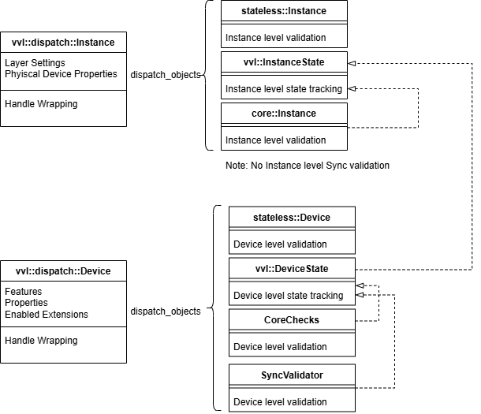
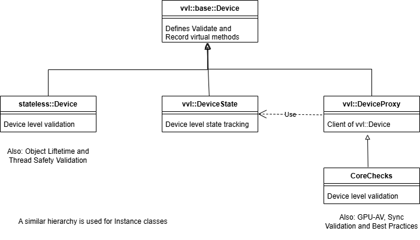

## Introduction

The Vulkan-ValidationLayers project has had its architecture evolve several times since it was started. Initially, validation was implemented as independent layers, which could be enabled using the vulkan loader.  This design had high overhead and was difficult to test since the layers could be enabled in any order, which could cause very different behaviors. 

So all of the separate layers were combined into a single layer. The original layers were now called validation objects. A component called the chassis was made which intercepts vulkan commands and let validation objects do validation and track state. Several of the validation objects used common code to do state tracking, but since state tracking was implemented in a base class, each validation object had its own copy of the state data. This was redundant both for memory and CPU overhead.

Recently, state tracking was changed so that all validation objects now share a single state tracker. This phase of the architecture is described here.
Eventually this will be use to allow different validation objects (such as GPU-AV and synval) to share state information.

## Dispatch objects

The 'top-level' of the chassis is implemented by `vvl::dispatch::Instance` and `vvl::dispatch::Device`. These are containers for all of the active validation objects. For each Vulkan command `vkFoo()` the following sequence will be run:

```
for all validation objects:
    skip |= PreCallValidateFoo()
// skip can set by the VK_EXT_debug_utils message callback, which allows
// applications to avoid issuing an invalid vulkan command to the ICD.
if (skip):
    return
for all validation objects:
	PreCallRecordFoo()
// Call into the ICD, wrapping and unwrapping Vulkan handles (if enabled)
DispatchFoo()
for all validation objects:
    PostCallRecordFoo()
```



The diagram above shows what the dispatch objects would look like when stateless, core and sync validation are enabled. The shared state tracker is also enabled because it is needed by core and sync validation.

### Features, properties and enabled extensions

The dispatch objects also store cached copies of device properties, enabled features and enabled extensions. These are frequently used by all types of validation so storing them centrally avoids code duplication and reduces memory footprint.

### Handle wrapping

Validation has an option to replace ICD handles with generated handles which are not pointers and should be consistent run to run. Unfortunately this requires some state tracking to properly substitute in the correct handles when calling down to the ICD. This state is a separate subset of what is done by the state tracker. 

## Base validation objects

`vvl::base::Device` and `vvl::base::Instance` provide the minimal interface for implementing a validation object. Stateless, object tracking and thread safety validation inherit directly from these classes, other types of validation use the state tracker, described below. These classes define the `PreCallValidate`, `PreCallRecord` and `PostCallRecord` methods used by the dispatch objects for all Vulkan commands.

## State tracking

State tracking is implemented by `vvl::InstanceState` and `vvl::DeviceState`. In most cases, these objects are run by the dispatch object before any other validation objects that require state tracking. However, for commands that destroy a state object, such as `vkDestroyImage`, the state tracker runs last, since it will destroy the state object and other validation objects might need to use it first.

Validation that requires state tracking is implemented by inheriting from `vvl::InstanceProxy` and `vvl::DeviceProxy`, which allow access to shared state.



The diagram above shows the class hierarchy used for validation objects.

### Substates

Some validations objects require additional state to be tracked for various state objects, such as command buffers, images and queues.  When each validation type had its own state tracker, this was implemented using derived classes and factory methods for creating state objects. With the shared state tracker, specialization by inheritance is not possible. Instead, some state objects implement sub states, which can be used to store additional data. Some sub state types also provide virtual methods which can be overridden to perform actions when something happens to the state object. When this happens, the substates are called in the same order used by the dispatch objects.

