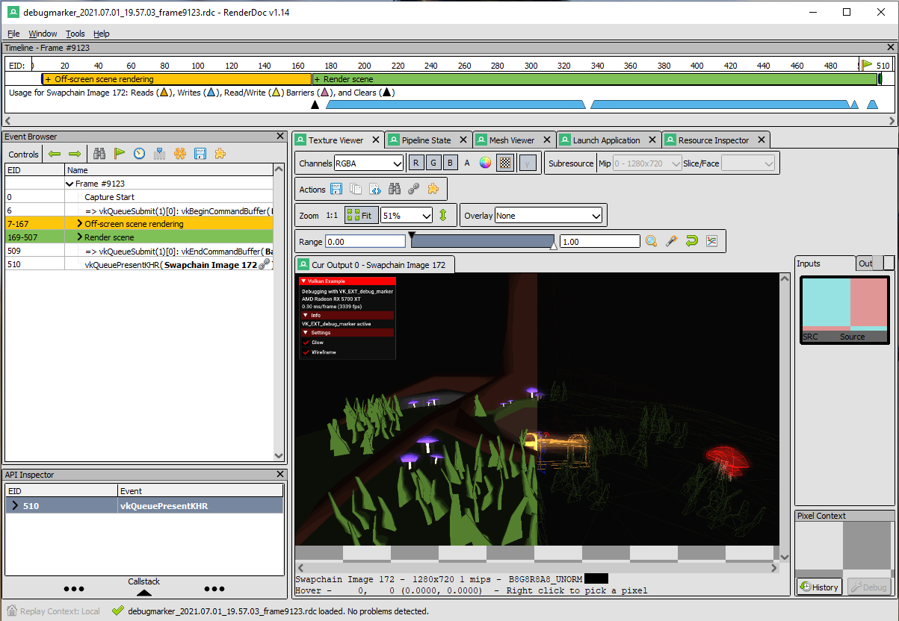
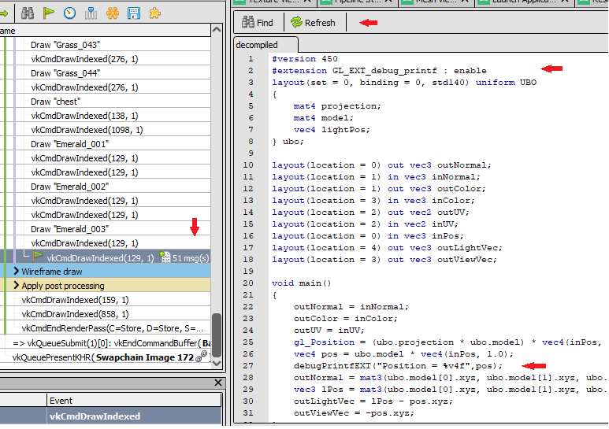
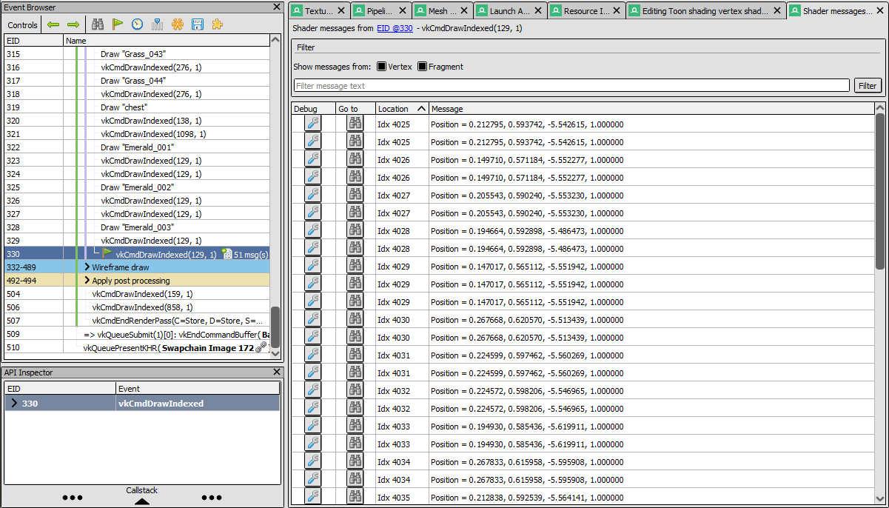
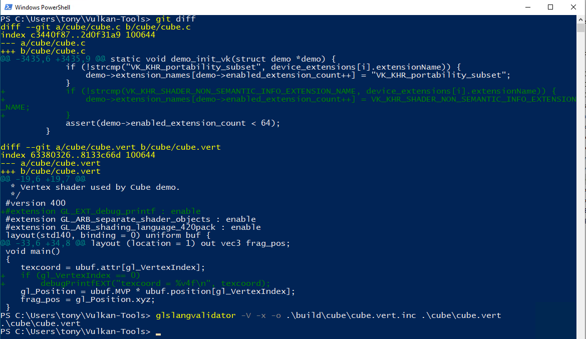
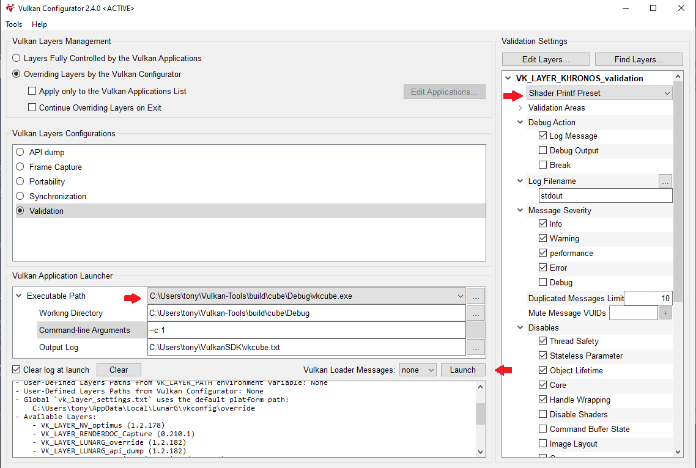
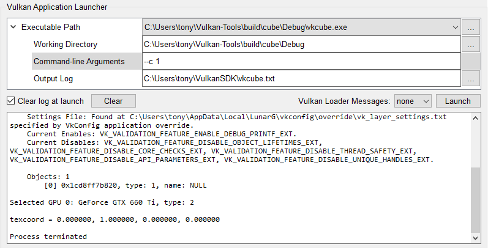

<!-- markdownlint-disable MD041 -->
<!-- Copyright 2020-2026 LunarG, Inc. -->
<!-- Copyright 2020-2026 Valve Corporation -->
[![Khronos Vulkan][1]][2]

[1]: https://vulkan.lunarg.com/img/Vulkan_100px_Dec16.png "https://www.khronos.org/vulkan/"
[2]: https://www.khronos.org/vulkan/

# Using Debug Printf

## Introduction

This is an overview how to use c-style `printf` statements directly into shaders for real-time inspection. This is currently supported in GLSL, HLSL, and Slang and should be **simple** to add to your debugging workflow right now!

## Quick understanding Debug Printf

Without going into too much details, this is all possible because of the interface provided by the [VK_KHR_shader_non_semantic_info](https://github.com/KhronosGroup/SPIRV-Guide/blob/main/chapters/nonsemantic.md) extension, which was promoted to Vulkan 1.3

To get Debug Printf to work you need 2 things:

1. A way to add to the shader (which GLSL/HLSL/Slang provide)
2. An implementation to consume the printf statement and print it out for you

The main two implementations are inside the Validation Layers and RenderDoc.

## Turning on Debug Printf in Validation Layer

We suggest to use Vulkan Configurator (`VkConfig`) to enable Debug Printf

For those who "just need to quick use it" there is a `VK_LAYER_PRINTF_ONLY_PRESET` environment variable that will turn on Debug Printf and turn off all of the other validation logic.

```bash
# Windows
set VK_LAYER_PRINTF_ONLY_PRESET=1

# Linux
export VK_LAYER_PRINTF_ONLY_PRESET=1

# Android
adb shell setprop debug.vulkan.khronos_validation.printf_only_preset=1
```

Note this will print to the debug callback and you might want it directly sent to `stdout`.

```bash
# Optional - will print to `stdout` **instead** of the normal Debug Callback
export VK_LAYER_PRINTF_TO_STDOUT=1
```

### Turn on with other validation

The `VK_LAYER_PRINTF_ENABLE=1` environment variable (`printf_enable` for people using `VK_EXT_layer_settings`) will turn on Debug Printf alongside the other validation.

## Settings

There are a few additional Debug Printf settings

> All settings also found in `VkConfig`

- `VK_LAYER_PRINTF_VERBOSE`
    - Will print extra information (pipeline, shader, command, etc)
    - `VK_LAYER_PRINTF_VERBOSE=1` (env variable)
    - 'printf_verbose` (`VK_EXT_layer_settings`)
- `VK_LAYER_PRINTF_BUFFER_SIZE`
    - Set the size in bytes of the buffer per `VkCommandBuffer` to hold the messages (Each message is about 50 bytes)
    - Default: 1024 bytes
    - `VK_LAYER_PRINTF_BUFFER_SIZE=4096`  (env variable)
    - 'printf_buffer_size` (`VK_EXT_layer_settings`)

## Using Debug Printf in GLSL Shaders

To use Debug Printf in GLSL shaders, you need to enable the `GL_EXT_debug_printf` extension.
Then add `debugPrintfEXT()` calls at the locations in your shader where you want to print
messages and/or values
Here is a very simple example ([Try Online](https://godbolt.org/z/MnYGj8azM)):

```glsl
#version 450
#extension GL_EXT_debug_printf : enable
void main() {
    float myfloat = 3.1415f;
    debugPrintfEXT("My float is %f", myfloat);
}
```

`glslang` will automatically add the Debug Printf instructions

## Using Debug Printf in HLSL and Slang Shaders

In HLSL and Slang, Debug Printf can be invoked as follows ([Try Online](https://godbolt.org/z/3ThznsdK8)):

```glsl
void main() {
    float myfloat = 3.1415;
    printf("My float is %f", myfloat);
}
```

Both `dxc` and `slangc` will automatically add the Debug Printf instructions

## Recommendations

If you print every time a shader is executed you can easily get millions of things trying to print. It is recommended to use built-ins to limit what is printed

```glsl
// Vertex Shader
if (gl_VertexIndex == 0) {
    debugPrintfEXT("Only print for a single vertex shader invocation\n");
}

// Fragment Shader
if (gl_FragCoord.x > 0.0 && gl_FragCoord.x < 0.1 &&
    gl_FragCoord.y > 0.0 && gl_FragCoord.y < 0.1) {
    debugPrintfEXT("Only print for a few fragment shader invocation\n");
}

// Compute Shader
if (gl_LocalInvocationIndex == 0) {
    debugPrintfEXT("Only print for a single compute invocation\n");
}
```

## Debug Printf Output

Debug Printf error message are returned as `VK_DEBUG_UTILS_MESSAGE_SEVERITY_INFO_BIT_EXT`

For your custom callback, you can look for `0x4fe1fef9` in `VkDebugUtilsMessengerCallbackDataEXT::messageIdNumber` as the magic hash if it is a Debug Printf message

The Validation Layers will try to turn on `info` level messages when using Debug Printf so the message is found

The `VkDebugUtilsMessengerCallbackDataEXT::pMessage` will contain the location and on a newline print out the error message such as:

> vkQueueSubmit(): pSubmits[0] Debug Printf:
>
> x == 100

### Debug Printf Format String

The format string for this implementation of debug printf is more restricted than the traditional printf format string.

Format for specifier is "%"*precision* <d, i, o, u, x, X, a, A, e, E, f, F, g, G, ul, lu, or lx>

Format for **vector** specifier is "%"*precision*"**v**" [2, 3, or 4] [specifiers list above]

Format for pointers (`PhysicalStorageBuffer`) is "%p"

- The vector value separator is ", "
- "%%" will print as "%"
- No length modifiers.  Everything except ul, lu, and lx is 32 bits, and ul and lx values are printed in hex
- No strings or characters allowed
- No flags or width specifications allowed
- No error checking for invalid format strings is done.

For example:
```
float myfloat = 3.1415f;
vec4 floatvec = vec4(1.2f, 2.2f, 3.2f, 4.2f);
uint64_t bigvar = 0x2000000000000001ul;
```
`debugPrintfEXT("Here's a float value to 2 decimals %1.2f", myfloat);`
Would print **"Here's a float value to 2 decimals 3.14"**

`debugPrintfEXT("Here's a vector of floats %1.2v4f", floatvec);`
Would print **"Here's a vector of floats 1.20, 2.20, 3.20, 4.20"**

`debugPrintfEXT("Unsigned long as decimal %lu and as hex 0x%lx", bigvar, bigvar);`
Would print **"Unsigned long as decimal 2305843009213693953 and as hex 0x2000000000000001"**


## Debug Printf messages in RenderDoc

As of RenderDoc release 1.14, Debug Printf statements can be added to shaders, and debug
printf messages will be received and logged in the Event Browser window.

Using the debugmarker sample from Sascha Willems' Vulkan samples repository:

1. Capture a frame:


2. Edit the shader:
- Add `#extension GL_EXT_debug_printf : enable` to beginning of shader
- Add `debugPrintfEXT("Position = %v4f", pos);` to shader after pos definition
- Hit Refresh



The vkCmdDrawIndexed in question now has 51 messages.

3. Click on msg(s) to see Debug Printf output per draw:


## Using Debug Printf in SPIR-V Shaders

Normally, developers will use a high-level language like HLSL or GLSL to generate SPIR-V.
However, in some cases, developers may wish to insert Debug Printfs directly into SPIR-V

To execute Debug Printf in a SPIR-V shader, a developer will need the following two
instructions specified:

```
OpExtension "SPV_KHR_non_semantic_info"
%N0 = OpExtInstImport NonSemantic.DebugPrintf
```

Debug Printf operations can then be specified in any function with the following instruction:
`%NN = OpExtInst %void %N0 1 %N1 %N2 %N3` ...
where:
* `N0` is the result id of the `OpExtInstImport NonSemantic.DebugPrintf`
* `1` is the opcode of the Debug Printf instruction in `NonSemantic.DebugPrintf`
* `N1` is the result of an OpString containing the format for the Debug Printf
* `N2`, `N3`, ... are result ids of scalar and vector values to be printed
* `NN` is the result id of the Debug Printf operation. This value is undefined.

> `OpExtInstImport` of any `NonSemantic*` is properly supported with the `VK_KHR_shader_non_semantic_info` device extension. Some older compiler stacks might not handle these unknown instructions well, some will ignore it as desired.

## Debug Printf messages from Validation Layers via VkConfig (Vulkan Configurator)

Here's an example of adding a Debug Printf statement to the shader in the `vkcube` demo (from
the `Vulkan-Tools` repository), and then using `VkConfig` to enable Debug Printf, launch vkcube,
and see the Debug Printf output.
1. Add Debug Printf to the vkcube demo:
 - Add `VK_KHR_shader_non_semantic_info` to cube's `CreateDevice` function
 - Add extension and `debugPrintfEXT` call to the shader
 - Use `glslangvalidator` to compile the new shader
 - (Offscreen) Rebuild vkcube



2. Configure `VkConfig` to enable Debug Printf
 - Set Shader Printf Preset
 - Set the executable path to the vkcube demo and add --c 1 to the command line to render one frame
 - Click the "Launch" button



3. See the Debug Printf output in Launcher window:


### Limitations
* Debug Printf consumes a descriptor set. If your application uses every last
descriptor set on the GPU, Debug Printf will not work.
* Debug Printf consumes device memory on the GPU. Large or numerous Debug Printf
messages can exhaust device memory. See settings above to control
buffer size.
  * Can be controlled with `VK_LAYER_PRINTF_BUFFER_SIZE`
* Validation Layers version: `1.2.135.0` or later is required
* Vulkan API version 1.1 or greater is required
* When using Validation Layers, the `fragmentStoresAndAtomics`, `vertexPipelineStoresAndAtomics`, and `timelineSemaphore` features are required
* The `VK_KHR_shader_non_semantic_info` extension must be supported and enabled
  * If using the Validation Layers, we attempt to strip it out to allow wider range of users to still use Debug Printf
* RenderDoc release 1.14 or later

### Other References
Documentation for the GL_EXT_debug_printf extension can be found
[here](https://github.com/KhronosGroup/GLSL/blob/main/extensions/ext/GLSL_EXT_debug_printf.txt)

There are many validation layer tests that demonstrates the simple and programmatic use of Debug
Printf. See `tests/unit/debug_printf.cpp` in the Vulkan-ValidationLayers repository.

Earlier implementations implicitly included stage specific built-in variables such as `gl_InvocationID`, `gl_VertexID` and `gl_FragCoord` in Debug Printf messages. This functionality has been removed because it made Debug Printf unusable in shader modules that defined entry points for multiple pipeline stages. If necessary, you can add these values to your printf statements explicitly. However, you must then make sure that the printf statement can only be executed from a pipeline stage where the built-in variable is available.
