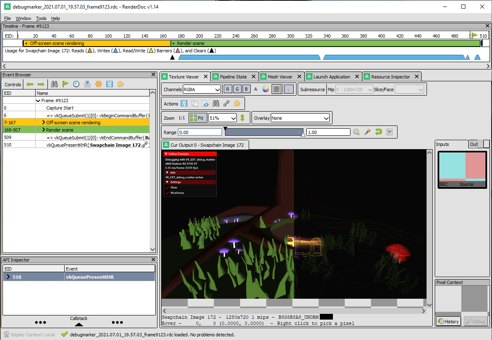
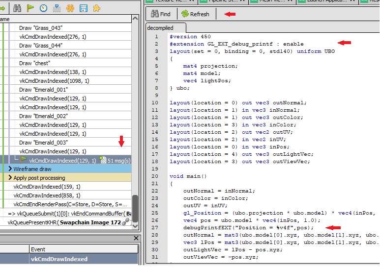
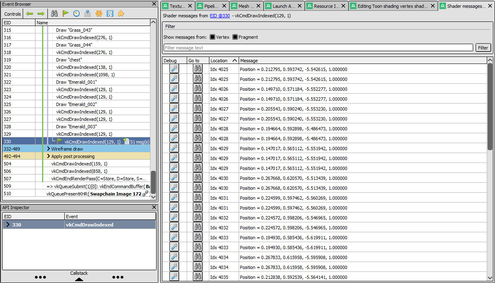
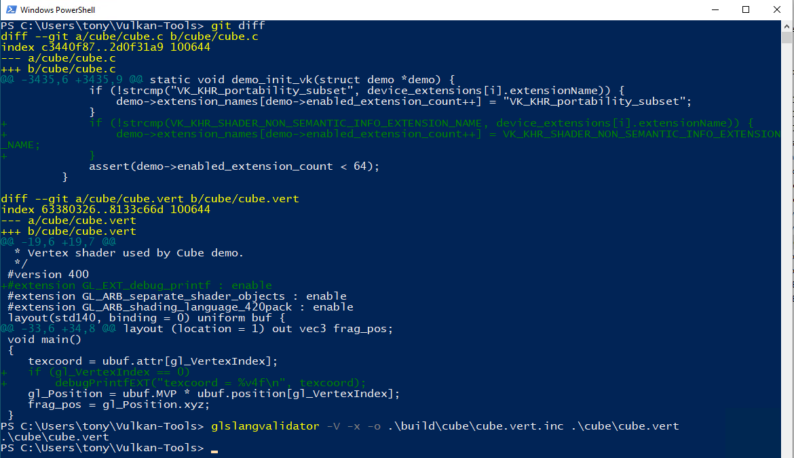
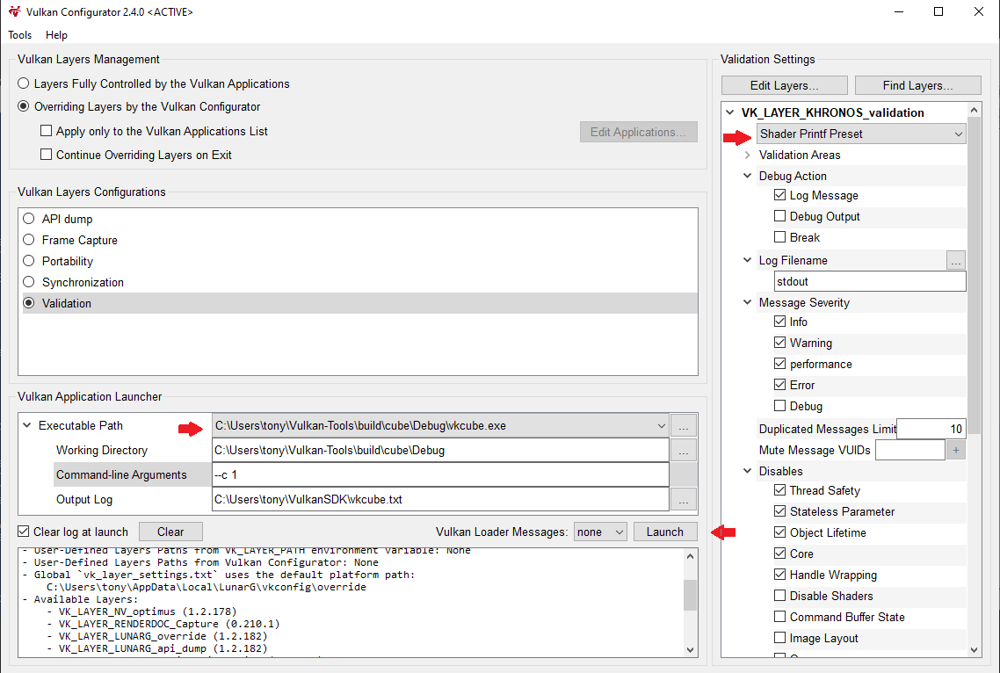

<!-- markdownlint-disable MD041 -->
<!-- Copyright 2020-2024 LunarG, Inc. -->
<!-- Copyright 2020-2024 Valve Corporation -->
[![Khronos Vulkan][1]][2]

[1]: https://vulkan.lunarg.com/img/Vulkan_100px_Dec16.png "https://www.khronos.org/vulkan/"
[2]: https://www.khronos.org/vulkan/

# Using Debug Printf

## Introduction
Debugging Vulkan shaders, especially compute shaders, can be very difficult to do even with the aid
of a powerful debugging tool like RenderDoc. Debug Printf is a recent Vulkan feature that allows
developers to debug their shaders by inserting Debug Print statements. This feature is now
supported within RenderDoc in a way that allows for per-invocation inspection of values in a shader.
This article describes how to instrument your GLSL or HLSL shaders with Debug Printf and how to
inspect and debug with them in RenderDoc, using vkconfig, or with environment variables.

## Configuring Debug Printf in Validation Layer

For an overview of how to configure layers, refer to the [Layers Overview and Configuration](https://vulkan.lunarg.com/doc/sdk/latest/windows/layer_configuration.html) document.

The Debug Printf settings are managed by configuring the Validation Layer. These settings are described in the
[VK_LAYER_KHRONOS_validation](https://vulkan.lunarg.com/doc/sdk/latest/windows/khronos_validation_layer.html#user-content-layer-details) document.

Debug Printf settings can also be managed using the [Vulkan Configurator](https://vulkan.lunarg.com/doc/sdk/latest/windows/vkconfig.html) included with the Vulkan SDK.

For those who "just need to quick use it" there is also a `set VK_LAYER_PRINTF_ONLY_PRESET=1` environment variable that will turn on DebugPrintf and turn off all of the other validation logic.

### Settings

> All settings are found in Vulkan Configurator (`VkConfig`)
>
> Even if you use `VK_LAYER_PRINTF_ONLY_PRESET` you need to set those settings yourself as desired

There are currently 3 environment variables that are used for settings in Debug Printf

- `VK_LAYER_PRINTF_TO_STDOUT` will print to `stdout` **instead** of the normal Debug Callback
    - `VK_LAYER_PRINTF_TO_STDOUT=1` turn on
    - `VK_LAYER_PRINTF_TO_STDOUT=0` turn off
- `VK_LAYER_PRINTF_VERBOSE` will print extra information (pipeline, shader, command, etc)
    - `VK_LAYER_PRINTF_VERBOSE=1` turn on
    - `VK_LAYER_PRINTF_VERBOSE=0` turn off
- `VK_LAYER_PRINTF_BUFFER_SIZE` size of the buffer used to store Printf messages (buffer is shared across all calls in a single `vkQueueSubmit`).
    - Default: 1024 bytes
    - `set VK_LAYER_PRINTF_BUFFER_SIZE=4096` (example of making it larger)

## Using Debug Printf in GLSL Shaders

To use Debug Printf in GLSL shaders, you need to enable the GL_EXT_debug_printf extension.
Then add debugPrintfEXT calls at the locations in your shader where you want to print
messages and/or values
Here is a very simple example ([Try Online](https://godbolt.org/z/MnYGj8azM)):
```
#version 450
#extension GL_EXT_debug_printf : enable
void main() {
    float myfloat = 3.1415f;
    debugPrintfEXT("My float is %f", myfloat);
}
```
Then use `glslangValidator` to generate SPIR-V to use in `vkCreateShaderModule`.
`glslangvalidator --target-env vulkan1.2 -e main -o shader.vert.spv shader.vert` would be one
example of compiling shader.vert

Note that every time this shader is executed, `My float is 3.141500` will be printed. If this were
in a vertex shader and a triangle was drawn, it would be printed 3 times.

## Using Debug Printf in HLSL Shaders

In HLSL, debug printf can be invoked as follows ([Try Online](https://godbolt.org/z/3ThznsdK8)):
```
void main() {
    float myfloat = 3.1415;
    printf("My float is %f", myfloat);
}
```
Use `glslangValidator` or `dxc` to generate SPIR-V for this shader.
For instance:
- `glslangValidator.exe -D --target-env vulkan1.2 -e main -o shader.vert.spv shader.vert`
- `dxc.exe -spirv -E main -T ps_6_0 -fspv-target-env=vulkan1.2 shader.vert -Fo shader.vert.spv`

## Using Debug Printf in SPIR-V Shaders

Normally, developers will use a high-level language like HLSL or GLSL to generate SPIR-V.
However, in some cases, developers may wish to insert Debug Printfs directly into SPIR-V

To execute debug printfs in a SPIR-V shader, a developer will need the following two
instructions specified:

```
OpExtension "SPV_KHR_non_semantic_info"
%N0 = OpExtInstImport NonSemantic.DebugPrintf
```

Debug printf operations can then be specified in any function with the following instruction:
`%NN = OpExtInst %void %N0 1 %N1 %N2 %N3` ...
where:
* `N0` is the result id of the OpExtInstImport NonSemantic.DebugPrintf
* `1` is the opcode of the DebugPrintf instruction in NonSemantic.DebugPrintf
* `N1` is the result of an OpString containing the format for the debug printf
* `N2`, `N3`, ... are result ids of scalar and vector values to be printed
* `NN` is the result id of the debug printf operation. This value is undefined.

> `OpExtInstImport` of any `NonSemantic*` is properly supported with the `VK_KHR_shader_non_semantic_info` device extension. Some older compiler stacks might not handle these unknown instructions well, some will ignore it as desired.

## Debug Printf Output
The strings resulting from a Debug Printf will, by default, be sent to the debug callback
which is either specified by the app, or by default sent to stdout.
They are sent at the `VK_DEBUG_REPORT_INFORMATION_BIT_EXT` or `VK_DEBUG_UTILS_MESSAGE_SEVERITY_INFO_BIT_EXT`
level.

## Debug Printf messages in RenderDoc

As of RenderDoc release 1.14, Debug Printf statements can be added to shaders, and debug
printf messages will be received and logged in the Event Browser window.

Using the debugmarker sample from Sascha Willems' Vulkan samples repository:

1. Capture a frame:


2. Edit the shader:
- Add `#extension GL_EXT_debug_printf : enable` to beginning of shader
- Add `debugPrintfEXT("Position = %v4f", pos);` to shader after pos definition
- Hit Refresh



The vkCmdDrawIndexed in question now has 51 messages.

3. Click on msg(s) to see Debug Printf output per draw:


## Debug Printf messages from Validation Layers via VkConfig (Vulkan Configurator)

Here's an example of adding a Debug Printf statement to the shader in the `vkcube` demo (from
the `Vulkan-Tools` repository), and then using `VkConfig` to enable Debug Printf, launch vkcube,
and see the Debug Printf output.
1. Add Debug Printf to the vkcube demo:
 - Add `VK_KHR_shader_non_semantic_info` to cube's `CreateDevice` function
 - Add extension and `debugPrintfEXT` call to the shader
 - Use `glslangvalidator` to compile the new shader
 - (Offscreen) Rebuild vkcube



2. Configure `VkConfig` to enable Debug Printf
 - Set Shader Printf Preset
 - Set the executable path to the vkcube demo and add --c 1 to the command line to render one frame
 - Click the "Launch" button



3. See the Debug Printf output in Launcher window:


### Debug Printf Format String

The format string for this implementation of debug printf is more restricted than the traditional printf format string.

Format for specifier is "%"*precision* <d, i, o, u, x, X, a, A, e, E, f, F, g, G, ul, lu, or lx>

Format for vector specifier is "%"*precision*"v" [2, 3, or 4] [specifiers list above]

- The vector value separator is ", "
- "%%" will print as "%"
- No length modifiers.  Everything except ul, lu, and lx is 32 bits, and ul and lx values are printed in hex
- No strings or characters allowed
- No flags or width specifications allowed
- No error checking for invalid format strings is done.

For example:
```
float myfloat = 3.1415f;
vec4 floatvec = vec4(1.2f, 2.2f, 3.2f, 4.2f);
uint64_t bigvar = 0x2000000000000001ul;
```
`debugPrintfEXT("Here's a float value to 2 decimals %1.2f", myfloat);`
Would print **"Here's a float value to 2 decimals 3.14"**

`debugPrintfEXT("Here's a vector of floats %1.2v4f", floatvec);`
Would print **"Here's a vector of floats 1.20, 2.20, 3.20, 4.20"**

`debugPrintfEXT("Unsigned long as decimal %lu and as hex 0x%lx", bigvar, bigvar);`
Would print **"Unsigned long as decimal 2305843009213693953 and as hex 0x2000000000000001"**

### Limitations
* Debug Printf consumes a descriptor set. If your application uses every last
descriptor set on the GPU, Debug Printf will not work.
  * Suggest using `VK_VALIDATION_FEATURE_ENABLE_GPU_ASSISTED_RESERVE_BINDING_SLOT_EXT`
* Debug Printf consumes device memory on the GPU. Large or numerous Debug Printf
messages can exhaust device memory. See settings above to control
buffer size.
  * Can be controlled with `VK_LAYER_PRINTF_BUFFER_SIZE`
* Validation Layers version: `1.2.135.0` or later is required
* Vulkan API version 1.1 or greater is required
* When using Validation Layers, the `fragmentStoresAndAtomics`, `vertexPipelineStoresAndAtomics`, and `timelineSemaphore` features are required
* The `VK_KHR_shader_non_semantic_info` extension must be supported and enabled
  * If using the Validation Layers, we attempt to strip it out to allow wider range of users to still use Debug Printf
* RenderDoc release 1.14 or later
* When using Debug Printf with a debug callback, it is recommended to disable validation,
as the debug level of INFO or DEBUG causes the validation layers to produce many messages
unrelated to Debug Printf, making it difficult to find the desired output.

### Other References
Documentation for the GL_EXT_debug_printf extension can be found
[here](https://github.com/KhronosGroup/GLSL/blob/main/extensions/ext/GLSL_EXT_debug_printf.txt)

There are many validation layer tests that demonstrates the simple and programmatic use of Debug
Printf. See `tests/unit/debug_printf.cpp` in the Vulkan-ValidationLayers repository.

Earlier implementations implicitly included stage specific built-in variables such as `gl_InvocationID`, `gl_VertexID` and `gl_FragCoord` in Debug Printf messages. This functionality has been removed because it made Debug Printf unusable in shader modules that defined entry points for multiple pipeline stages. If necessary, you can add these values to your printf statements explicitly. However, you must then make sure that the printf statement can only be executed from a pipeline stage where the built-in variable is available.
