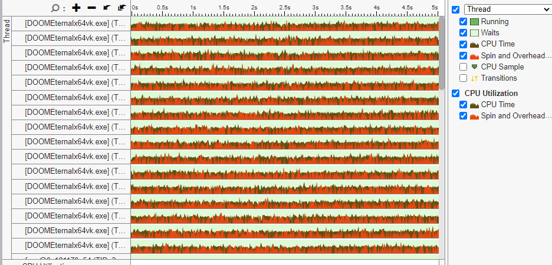
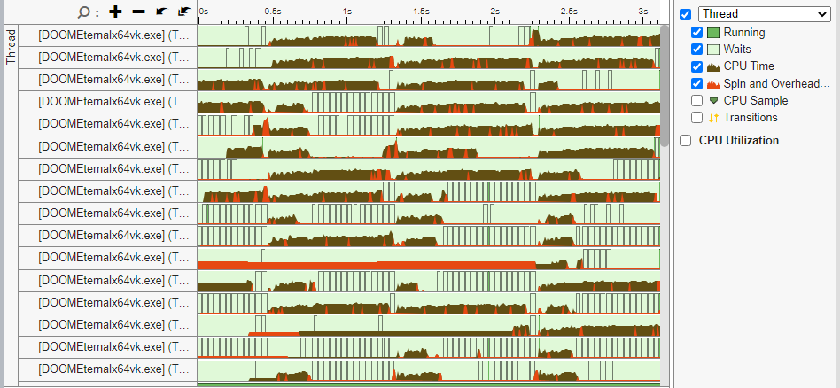
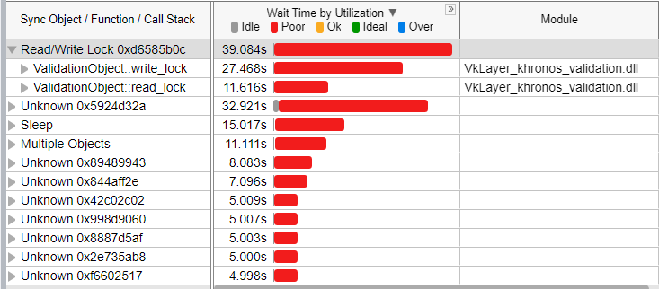

<!-- Copyright 2021-2023 LunarG, Inc. -->
[![Khronos Vulkan][1]][2]

[1]: https://vulkan.lunarg.com/img/Vulkan_100px_Dec16.png "https://www.khronos.org/vulkan/"
[2]: https://www.khronos.org/vulkan/

# Introduction

Fine grained locking is a performance improvement for multithreaded workloads. It allows Vulkan calls from different threads to be validated in parallel, instead of being serialized by a global lock. Waiting on this lock causes performance problems for multi-threaded applications, and most Vulkan games are heavily multi-threaded.  This feature has been tested with 15+ released games and improves performance in almost all of them, and many improve by about 150%.

This document describes the design of the optimization and is mainly targeted at ValidationLayer developers.  Information on how to enable and disable the optimization can be found [here](fine_grained_locking_usage.md).

# Motivation

Many Vulkan games are highly multithreaded and are able to make use of all CPU cores available. For example, DoomEternal can use at least 16 cores, as shown by the Intel VTune Profiler.





However, when the Vulkan ValidationLayer is enabled with the standard configuration, some cores spending nearly all of their time waiting (light green color)





 A great discussion of the id Tech 7 engine can be found [here](https://advances.realtimerendering.com/s2020/RenderingDoomEternal.pdf).

The largest location of wait time is ValidationObject::validation_object_mutex:




ValidationObject is the base class for the objects used by each part of the validation layer (Core Validation, Best Practices, Synchronization, GPUAV, DebugPrintf, and others). Each part of validation will have its own set of `ValidationObjects`, and different parts (such as Core Validation and Synchronization) can run in parallel with each other. There is one `ValidationObject` created for every `VkInstance` and `VkDevice` in the program, and in most cases there will only be one of each. Almost every Vulkan call will need to contend on the lock for the `VkDevice’s` `ValidationObject`.

The following pseudo-code shows how a Vulkan call, `vkFoo()`, is handled by the validation layer:


```
    // PreCallValidate phase
    // layer_data is the per-VkInstance or VkDevice data saved by the layer
    // object_dispatch is a vector of the active ValidationObjects
    for (auto intercept : layer_data->object_dispatch) {
        auto lock = intercept->ReadLock();
        skip |= intercept->PreCallValidateFoo(...)
        if (skip) return VK_ERROR_VALIDATION_FAILED_EXT;
    }
    // PreCallRecord phase
    for (auto intercept : layer_data->object_dispatch) {
        auto lock = intercept->WriteLock();
        intercept->PreCallRecordFoo(...);
    }
    // call down to next layer / ICD
    VkResult result = DispatchFoo(...);
    // PostCallRecord phase
    for (auto intercept : layer_data->object_dispatch) {
        auto lock = intercept->WriteLock();
        intercept->PostCallRecordFoo(...);
    }
```


For most multithreaded programs where Vulkan is used from more than one thread, this lock will be the biggest performance cost from enabling validation. Additionally, the lock limits what optimizations are effective within the validation layer code. If any optimization adds work to the Pre/PostCallRecord phase of a Vulkan call to save more work in subsequent PreCallValidate phases, there is a high chance that it will cause a multithreaded program to be slower. This is because the Pre/PostCallRecord phases run with the read/write lock held for writing, which prevents any other threads using Vulkan from running, but the read lock held during PreCallValidate allows other threads to run PreCallValidate code in parallel.


# Core validation changes

The current focus for optimization is core validation, implemented in the `CoreChecks` class. This is the most commonly used part of validation and it is complex and CPU intensive. `CoreChecks` and several other validation objects use common code for state tracking, implemented in the `ValidationStateTracker` class.  Because of this, other validation objects may have bugs or performance issues from using these experimental changes.


## Keep, but disable, validation_object_mutex

The `ValidationObject` methods `ReadLock()` and `WriteLock()` create lock guard objects that keep this mutex locked until they are destroyed. By overriding these methods to create the guards using the[ std::defer_lock](https://en.cppreference.com/w/cpp/thread/lock_tag) policy, the returned lock guard will not actually lock the lock. This technique is also used by the Thread Safety and Object Tracking validation objects.

The `CoreCheck's` `ValidationObject` overrides these methods to **optionally** lock `validation_object_mutex`, depending on a runtime setting.  If the environment variable `VK_LAYER_FINE_GRAINED_LOCKING` or the settings file value `khronos_validation.fine_grained_locking` is true, this lock will not be locked.

###### PRs:

[corechecks: Add setting to enable fine-grained locking](https://github.com/KhronosGroup/Vulkan-ValidationLayers/pull/3646)


## Thread safety goals

Vulkan places much of the burden of [thread safety](https://www.khronos.org/registry/vulkan/specs/1.3/html/vkspec.html#fundamentals-threadingbehavior) on the application author, by requiring parameters to API calls to be externally synchronized by the calling code.  The Thread Safety validation object performs checks to make sure that applications follow the synchronization requirements. It may be desirable to enable Thread Safety validation in the standard configurations so that users hit these errors before getting unexpected behavior from Core validation.

Because it is impossible to predict all possible ways an incorrect program behaves, we need to have limits on what is expected of core validation:

* Programs that run without errors from Thread Safety validation
    * MUST not cause crashes in the validation layer
    * MUST produce the same set of errors when validation with or without `validation_object_mutex` locking enabled.
    * The order in which errors are output MAY change from run to run due to unpredictability of CPU thread scheduling.
* Programs that have errors from Thread Safety validation
    * SHOULD not cause crashes in the validation layer
    * MAY produce incorrect output

Because validation often requires accessing objects in ways that go beyond their external synchronization requirements, locking will still be required in many parts of the code.


## State Objects

All Vulkan handles except `VkDevice` and `VkInstance` have a state object storing information needed for validation. State objects all inherit from the `BASE_NODE` class, and contain a combination of information determined at object creation time and information that changes based on how the object is used in other Vulkan API calls.


### Instance and Device object maps

State objects are stored in type specific maps within ValidationStateTracker.  The maps are set up with by macros declaring the handle type, the state object type and the name of the map member:


```
    VALSTATETRACK_MAP_AND_TRAITS(VkImage, IMAGE_STATE, imageMap);
```

Each map is implemented using `vl_concurrent_unordered_map`, which provides a locked map implementation and is already used elsewhere in the validation code. It is important to note that `vl_concurrent_unordered_map` doesn’t allow thread safe iteration across the map without making a copy of it. There are a few places in the code where this is currently required but they are not in performance critical paths.

The macros set up metadata required for the use of templated accessor methods, `Get<>()` which returns a `std::shared_ptr` to the state object.  Since only the map lookups will be guarded by a lock, Validate and Record entry points MUST hold the `shared_ptr` reference to ensure the state object isn’t deleted by another thread.   Other functions that use state objects SHOULD use raw pointers or references unless there is an ownership transfer. (The [Google C++ standard](https://google.github.io/styleguide/cppguide.html#Ownership_and_Smart_Pointers) and the [C++ Core Guidelines](https://isocpp.github.io/CppCoreGuidelines/CppCoreGuidelines#f7-for-general-use-take-t-or-t-arguments-rather-than-smart-pointers) have more thorough explanations of this recommendation).

There are also locking requirements for state object construction and destruction. Any member data of the state object available at creation time MUST be initialized by the constructor. If the data is never changed after creation, the member MUST be declared const so that the compiler can catch new code that requires the member to change (which in turn will require thought about new thread safety requirements). State objects MUST be constructed by a call to `std::make_shared<STATE_OBJECT>(...)`.  Insertion into the handle -> state object map will happen in a new `Add<STATE_OBJECT>()` template method, which enforces locking. Destruction is handled by calls `Destroy<STATE_OBJECT>()` template method which removes the state object from the map and then call its `Destroy()` method. This indicates that the object has been destroyed at the Vulkan API level, even if its shared_ptr reference count has not yet reached 0. In short, the object maps MUST NOT  contain partially constructed or destroyed objects.

###### PRs:

[layers: Add Add() and Destroy() for handle map management](https://github.com/KhronosGroup/Vulkan-ValidationLayers/pull/3490)

[layers: Stomp old values in ValidationStateTracker::Add()](https://github.com/KhronosGroup/Vulkan-ValidationLayers/pull/3501)

[layers: Make many state tracker data members protected or private](https://github.com/KhronosGroup/Vulkan-ValidationLayers/pull/3536)

[layers: Remove non-template GetFoo() state tracker methods](https://github.com/KhronosGroup/Vulkan-ValidationLayers/pull/3546)

[layers: Only support shared_ptr Get<>() methods](https://github.com/KhronosGroup/Vulkan-ValidationLayers/pull/3575)

[layers: Use concurrent_ordered_map for state objects](https://github.com/KhronosGroup/Vulkan-ValidationLayers/pull/3647)

[layers: Use a write lock in vl_concurrent_unordered_map::clear()](https://github.com/KhronosGroup/Vulkan-ValidationLayers/pull/3660)


### Command Buffer State Validation

This part of validation checks that all Vulkan objects used by a command buffer have not been destroyed. To do this, `CoreChecks` [maintains a tree](https://github.com/KhronosGroup/Vulkan-ValidationLayers/pull/2807) of all Vulkan objects that are in use by another Vulkan object:


```
    // Parent nodes are stored as weak_ptrs to avoid cyclic memory dependencies.
    // Because weak_ptrs cannot safely be used as hash keys, the parents are stored
    // in a map keyed by VulkanTypedHandle. This also allows looking for specific
    // parent types without locking every weak_ptr.
    using NodeMap = vvl::unordered_map<VulkanTypedHandle, std::weak_ptr<BASE_NODE>>;
  private:
    ReadLockGuard ReadLockTree() const { return ReadLockGuard(tree_lock_); }
    WriteLockGuard WriteLockTree() { return WriteLockGuard(tree_lock_); }

    // Set of immediate parent nodes for this object. For an in-use object, the
    // parent nodes should form a tree with the root being a command buffer.
    NodeMap parent_nodes_;
    // Lock guarding parent_nodes_, this lock MUST NOT be used for other purposes.
    mutable std::shared_mutex tree_lock_;
```


The tree is only accessible through methods of class BASE_NODE.  To allow the use of std::weak_ptr for parent references, BASE_NODE inherits from [std::enable_shared_from_this<BASE_NODE>](https://en.cppreference.com/w/cpp/memory/enable_shared_from_this). This adds a shared_from_this() method which returns a shared pointer to the object it is called on.  This method is most often used to get a weak_ptr parent reference. In C++17, a `weak_from_this()` method is available which would be more concise and slightly more efficient. Using shared_from_this() only works on objects stored in shared pointers, which is why it state objects MUST be constructed with `std::make_shared<>`.

`AddParent()` and `RemoveParent()` manage the contents of the tree. For example, when creating a `VkImageView`, the `IMAGE_VIEW_STATE` will be added to `IMAGE_STATE’s` parent_nodes_ with an `AddParent()`. During destruction of the `VkImageView`, the `IMAGE_VIEW_STATE` will be remove with a call to `RemoveParent()`. **IMPORTANT**:  `AddParent()` uses `shared_from_this(),` which only works after the constructor finishes executing. A second phase constructor `BASE_NODE::LinkChildNodes()` should be used to make `AddParent()` calls. `LinkChildNodes()` is called by the `Add()` method before inserting the new state object into the state object map.

`Destroy()` is called when the Vulkan object is destroyed. Note that because state objects are reference counted with a shared pointer, the state object might not be deleted and its destructor might not be called.

`Invalidate()` is called when the Vulkan object becomes invalid. Usually this is called from `Destroy()`, but in some cases descriptor sets call this when some of their descriptors are changed.  `Invalidate()` recursively calls a private method, `NotifyInvalidate()`, to tell all parents that the child has become invalid.

`InUse()` recursively walks up the tree looking for a parent node that is a command buffer that has been submitted to a queue (i.e. in the pending state).

All of the above methods are guarded by the per-node `tree_lock_`, which MUST NOT be used for other purposes.  A global tree lock implementation would have been simpler, but a prototype of it showed significant performance degradation, especially for large descriptor sets.

###### PRs:

[layers: Add BASE_NODE tree locking](https://github.com/KhronosGroup/Vulkan-ValidationLayers/pull/3658)

### Locking policy for state objects

State objects vary in complexity and thus have different policies for thread safety. The following sections describe these policies, with the most desirable options listed first.

#### Const only member data

It is very common for state objects to contain data that is set up at creation time and never modified. This data should be stored in `const` member data fields initialized by the state object constructor. This makes it clear to both the compiler and humans that the data is safe to access without locking.

The following objects have already been updated to meet the above construction requirements and now only have `const` data members. They do not require any additional locking. This is the best way to make a state object thread safe and should be used whenever possible!

* VkSampler / SAMPLER_STATE
* VkSamplerYcbcrConversion / SAMPLER_YCBCR_CONVERSION_STATE
* VkRenderPass / RENDER_PASS_STATE
* VkFramebuffer / FRAMEBUFFER_STATE
* VkBufferView / BUFFER_VIEW_STATE
* VkImageView / IMAGE_VIEW_STATE
* VkPipelineLayout / PIPELINE_LAYOUT_STATE
* VkDescriptorSetLayout / cvdescriptorset::DescriptorSetLayout
* VkQueryPool / QUERY_POOL_STATE
* VkShaderModule / SHADER_MODULE_STATE
* VkPipeline / Pipeline state

Other state objects SHOULD make member data fields `const` if possible.

#### Fully encapsulated and locked member data

For data that must change after object creation, the next best strategy is to make data members private and provide accessor methods that provide thread safe access.  It is important to note that the common technique of returning const references from 'get' accessors is not thread safe, since this gives the caller unlocked access to memory that might then be modified by another thread. Instead, 'get' accessors should return a copy of the data so the caller is not affected by activity in other threads.

Thread safe accessors are very important for complex data structures such as vectors, sets, and maps. It may be possible in some cases to make simple counters or flags thread safe using `std::atomic` instead.

`SURFACE_STATE` is an example of a state object with fully encapsulated non-const data members.

#### Encapsulated with limited interactions with other state objects

In some cases, state objects need to interact with each other. If possible, this should be done through accessor methods that manage each objects locking. Usually each object should only hold a lock while modifying its own state, and only call methods on other state objects after unlocking. This helps to prevent deadlock. `QUEUE_STATE`, `SEMAPHORE_STATE` and `FENCE_STATE` are an example of encapsulated but interacting state objects.

#### Public non-const data and user controlled locking

`CMD_BUFFER_STATE` currently has many public non-const data members and does not manage its own locking. Instead it has public `ReadLock()` and `WriteLock()` methods to allow users to manage locking themselves. In most cases, this should be done by calling the state tracker `GetRead()` or `GetWrite()` methods to look up and then lock the state object.  **This is NOT a recommended model to follow in other state objects, as it is prone to deadlocks and race conditions.** More effort will be put into refactoring `CMD_BUFFER_STATE` and validation code to hopefully simplify the locking of this state object.


The following sections cover state objects with non-const data and describe how they have been made threadsafe.


## Instance Data


### VkInstance / ValidationStateTracker

There it not any instance member data in `ValidationStateTracker` other than state object maps. It would be nice if there were separate classes for `VkInstance` and `VkDevice` state but that is beyond the scope of this project.


### VkPhysicalDevice / PHYSICAL_DEVICE_STATE

Since VkPhysicalDevice handles persist until the VkInstance is destroyed, it is not necessary to hold shared_ptr reference counts on them.

The `queue_family_known_count` field is an uint32_t storing the maximum property count used in a call to `vkGetPhysicalDeviceQueueFamilyProperties2()`. The `vkGetPhysicalDeviceDisplayPlanePropertiesKHR_called` field and `display_plane_property_count uint32_t` field are similar but for display plane properties.

The `perf_counters` map is a per-queue family map of the results of calls to `vkEnumeratePhysicalDeviceQueueFamilyPerformanceQueryCounters()` which are not otherwise modified. These could be made const by adding query code to `PHYSICAL_DEVICE_STATE` construction.

###### PRs:

[layers: Set up QUEUE_STATE and PHYSICAL_DEVICE_STATE at create time](https://github.com/KhronosGroup/Vulkan-ValidationLayers/pull/3370)


## Device Data


### VkDevice / ValidationStateTracker

Since VkDevice’s state is a ValidationStateTracker, we don’t have a real C++ constructor. Instead Device state is set up in PostCallRecordCreateDevice().  The following members **could** be const, as they are set but never changed:

* physical_device_state

* instance_state

* enabled_features

* phys_dev_mem_props

* phys_dev_props

* phys_dev_props_core11

* phys_dev_props_core12

* device_group_create_info

* physical_device_count

* phys_dev_ext_props

* cooperative_matrix_properties

* device_queue_info_list

* CoreChecks::validation_cache_path


State tracker Per-Device state that is changed:

* ahb_ext_formats_map - map of android external format to VkFormatFeatureFlags. Thread safe because it uses `vl_concurrent_unordered_map`.
* custom_border_color_sampler_count - simple counter
* performance_lock_acquired - boolean flag
* fake_memory - fake address generator for synchronization validation, basically a uint64_t counter of the next free address

TODO: the counter flag members should be atomic.


### Validation cache

`CoreChecks::core_validation_cache` is a pointer to class `ValidationCache`, which maintains a set of previously validated shader hashes. The `ValidationCache` manages locking for its underlying data structure.


## Queue state


### VkQueue / QUEUE_STATE

QUEUE_STATE tracks command buffers, semaphores and fences that have been submitted to the to the queue, but have not finished executing:


```
    struct CB_SUBMISSION {
        struct SemaphoreInfo {
            std::shared_ptr<SEMAPHORE_STATE> semaphore;
            uint64_t payload{0};
        };

        std::vector<std::shared_ptr<CMD_BUFFER_STATE>> cbs;
        std::vector<SemaphoreInfo> wait_semaphores;
        std::vector<SemaphoreInfo> signal_semaphores;
        std::shared_ptr<FENCE_STATE> fence;
        uint32_t perf_submit_pass{0};
    };

    uint64_t seq_;
    std::deque<CB_SUBMISSION> submissions_;
```

Each `CB_SUBMISSION` structure contains the state for a single call to `vkQueueSubmit()`, `vkQueueSubmit2()` or `vkQueueBindSparse()`. They are stored in order in the `submissions_` dequeue until the state tracker determines that they have completed execution.

`seq_` is a sequence number that increments in every `vkQueueSubmit()` call. It is also stored in `SEMAPHORE_STATE` and `FENCE_STATE`, to track at what point in the queue they will signal.

`QUEUE_STATE::submissions_` and `seq_` are accessed during queue submissions, as well as when semaphore or fence state changes cause updates to the completion state of queues. In Vulkan calls to check the status of a fence or semaphore, the state tracker uses the sequence numbers to figure out how far execution of the queue has progressed and update the state of any objects earlier in the queue, which must have finished executing. Because this process happens in functions that do not require external synchronization on the queue, such as `vkGetFenceStatus()` and `vkWaitSemaphores()`, access to the dequeue and `seq_` are  lock guarded.

Snce `VkQueues`  exist until their `VkDevice` is destroyed, it is not necessary to use shared pointers for every reference to them.

### VkFence / FENCE_STATE

`FENCE_STATE` contains the following non-const members, which are used through accessor methods that manage locking:


        QUEUE_STATE *queue_{nullptr};
        uint64_t seq_{0};
        FENCE_STATUS state;
        SyncScope scope{kSyncScopeInternal};

This data is used to track the current state of the `VkFence`, and its position in the `VkQueue` that will signal it. `FENCE_STATE` calls `QUEUE_STATE::Retire()` when it detects that the `VkFence` has been signaled. `QUEUE_STATE::Retire()` then updates its state for anything submitted before the fence.

### VkSemaphore / SEMAPHORE_STATE

`SEMAPHORE_STATE` contains the following non-const members, which are used through accessor methods that manage locking:


        SyncScope scope_{kSyncScopeInternal};
         struct SemOp {
            enum OpType op_type; /* values: kNone, kWait, kSignal, kBinaryAcquire, kBinaryPresent */
            QUEUE_STATE *queue;
            uint64_t seq;
            uint64_t payload;
        };
        // the most recently completed operation
        SemOp completed_;
        uint64_t next_payload_;
        std::multiset<SemOp> operations_;

Vulkan semaphores are extremely complicated, and timeline semaphores behave very differently from binary semaphores. `SEMAPHORE_STATE` behaves slightly differently depending on if it is used for a timeline or binary semaphore.

For timeline semaphores, the `operations_` multiset stores all pending waits or signals, sorted by the `SemOp::payload` field, which is the user specified value. There can be multiple operations associated with each `payload` value and they can be added in almost any order.  Additionally, one signal operation could cause many wait operations to be completed.  All of these operations could be on different `VkQueues`. Because of this, the code for updating the state of the semaphore is more complex than for `FENCE_STATE`:

    // Remove completed operations and return highest sequence numbers for all affected queues
    using RetireResult = vvl::unordered_map<QUEUE_STATE *, uint64_t>;
    RetireResult Retire(QUEUE_STATE *queue, uint64_t payload);

`RetireResult` makes it possible to handle state changes for several queues.  When called from `QUEUE_STATE::Retire()`, the `RetireResult`(s) for all `CB_SUBMISSIONS` is saved until the end of the current queue's processing, so that Retire() can be called on other queues without any locks held. `SEMAPHORE_STATE::Retire()` can also be called from `vkWaitSemaphores()` or `vkGetSemaphoreCounterValueKHR()`, but these cases are much simpler.

For binary semaphores, `SemOp::payload` is set from the `next_payload_` counter. Each semaphore operation will have a unique `payload` value. Having a `payload` value lets binary semaphores be treated as very simple and restricted timeline semaphores in most of the code.  Additionally, semaphores used with `vkQueuePresentKHR()` or `vkAcquireNextImageKHR()` must be treated specially because it isn't currently possible for the state tracker to reliably know when these semaphores change state.

###### PRs:

[layers: Clean up QUEUE_STATE, FENCE_STATE and SEMAPHORE_STATE](https://github.com/KhronosGroup/Vulkan-ValidationLayers/pull/3284)

[layers: Further clean up of FENCE_STATE, SEMAPHORE_STATE and QUEUE_STATE](https://github.com/KhronosGroup/Vulkan-ValidationLayers/pull/3610)

[layers: Make QUEUE_STATE and related classes threadsafe](https://github.com/KhronosGroup/Vulkan-ValidationLayers/pull/3656)

## Command Buffers

### VkEvent / EVENT_STATE

EVENT_STATE contains a counter to track if the event is set in a command buffer:


```
    int write_in_use;
```


It also tracks the stageMask used when setting the event, so that the wait stage mask can be validated if it occurs in a different command buffer:


```
     VkPipelineStageFlags2KHR stageMask;
```

TODO: These variables could be made thread safe using `std::atomic<>`.

### VkCommandPool / COMMAND_POOL_STATE

The only dynamic data in `COMMAND_POOL_STATE` is a set of all the command buffers allocated from the pool:


```
    vvl::unordered_set<VkCommandBuffer> commandBuffers;
```


This state is only changed in Vulkan functions that require external synchronization of the `VkCommandPool` handle. TODO: currently this object is not lock guarded but it could be converted to work like `DESCRIPTOR_POOL_STATE`, which is.


### VkCommandBuffer / CMD_BUFFER_STATE

`CMD_BUFFER_STATE` contains a large amount of data that is built up while commands are being recorded. There are around 30 non-const data members, so they are not listed here.

Some of this data is moved into global state during queue submission, while other data is no longer needed.

Command buffers have external synchronization requirements for every `vkCmd*()` function and most applications will use a command pool and the command buffers it creates from a single thread. Because of the complexity of this state object, it is still necessary to have a single lock to guard its data. A well behaved application will be unlikely to have multiple threads contending on this lock, and an incorrect application should be protected from crashing with minimal implementation complexity.

Command buffer locking is handled by the `StateTracker::GetWrite<>` and `GetRead<>` methods, which MUST be used instead of `Get<>`.  These methods return a `LockedSharedPtr` object which includes a read or write lock guard so that is held as long as the shared pointer is valid.

 **This scheme is fragile and likely to evolve in the future**. In the meantime, developers should be especially worried about deadlock by calling GetRead<> or GetWrtite<> multiple times on the same command buffer in a single validation hook command. For example, the following hook functions were buggy in their initial implementations:

```
 void CoreChecks::PreCallRecordCmdPipelineBarrier2(VkCommandBuffer commandBuffer,
                                                   const VkDependencyInfo *pDependencyInfo) {
    // BUG: this method gets a write lock
    auto cb_state = GetWrite<CMD_BUFFER_STATE>(commandBuffer);
    RecordBarriers(Func::vkCmdPipelineBarrier2, cb_state.get(), *pDependencyInfo);
    TransitionImageLayouts(cb_state.get(), pDependencyInfo->imageMemoryBarrierCount,
                           pDependencyInfo->pImageMemoryBarriers);
    // BUG: the state tracker method ALSO gets a write lock, which deadlocks!
    StateTracker::PreCallRecordCmdPipelineBarrier2(commandBuffer, pDependencyInfo);
 }
```

The recommended fix for the above code is to call the state tracker method BEFORE the corechecks code that locks the command buffer, or to scope `{}` the corechecks code so that the `LockedSharedPtr` is destroyed and unlocked before the state tracker method is called.

Another example:

```
bool CoreChecks::PreCallValidateCmdSetScissorWithCount(VkCommandBuffer commandBuffer, uint32_t scissorCount,
                                                       const VkRect2D *pScissors) const {
    // BUG: this method takes a read lock
    auto cb_state = GetRead<CMD_BUFFER_STATE>(commandBuffer);
    bool skip = false;
    // BUG: This helper method also called GetRead<>(), which will deadlock
    skip = ValidateExtendedDynamicState(commandBuffer, CMD_SETSCISSORWITHCOUNT, ...);
    skip |= ForbidInheritedViewportScissor(commandBuffer, cb_state.get(),
                                           "VUID-vkCmdSetScissorWithCount-commandBuffer-04820",
                                           CMD_SETSCISSORWITHCOUNTEXT);

    return skip;
}

```
This code will deadlock if the code is compiled using C++11, which uses std::mutex because std::shared_mutex (or std::shared_timed_mutex) aren't supported.
The recommended fix for this case is to not make helper methods that call GetRead<>, instead pass in a reference to the state object:

```
      skip = ValidateExtendedDynamicState(*cb_state, CMD_SETSCISSORWITHCOUNT, ...);
```

Note that not all legacy code, such as `ForbidInheritedViewportScissor()` has been completely cleaned up yet. That method takes both the vulkan handle and a state object pointer as arguments, which is safe but redundant.


#### Command buffer submission processing


##### Queries

During queue submission, query validation is performed via lambda functions added to `CMD_BUFFER_STATE::queryUpdates` by various CoreChecks methods. During the Validate phase, these are executed with the do_validate parameter set to true. And they are executed again during PostRecord with do_validate set to false. During submission, the final state of each `QueryObject` is updated into the corresponding `QUERY_POOL_STATE` object, which has a thread safe interface. When the command buffer is retired, all used `QueryObject` states are reset to `AVAILABLE`.


##### Events

Similar to queries, there are callbacks that validate and record event stage mask transitions in the command buffer. During submission the final stage mask generated by the command buffer is updated into `EVENT_STATE::stageMask` so that it becomes globally visible.

Additionally, any events that are set or reset in the command buffer have `EVENT_STATE::write_in_use` incremented during submission and decremented when the command buffer is retired.


##### Image Layout

Image Layout state is recorded and validated twice.  During command recording, data in `CMD_BUFFER_STATE` is used to track the current layouts as commands are recorded. During queue submission, the layout state is validated again and then copied into a global data structure so that it can be used in subsequent command buffers. This validation is discussed in more detail in the VkImage / IMAGE_STATE section.


##### QFO Transfers

CoreChecks maintains a maps of buffers and images involved in Queue Family Ownership transfer barriers:


```
GlobalQFOTransferBarrierMap<QFOImageTransferBarrier> qfo_release_image_barrier_map;
GlobalQFOTransferBarrierMap<QFOBufferTransferBarrier> qfo_release_buffer_barrier_map;
```

These maps are updated from per-CB maps during queue submission. Because QFO inherently involves multiple queues, access from multiple threads is likely. These data structures have been converted to use `vl_concurrent_unordered_map`, which is thread safe.

###### PRs:

[layers: Move state tracker methods to CMD_BUFFER_STATE](https://github.com/KhronosGroup/Vulkan-ValidationLayers/pull/3149)

[practices: Use subclassed CMD_BUFFER_STATE](https://github.com/KhronosGroup/Vulkan-ValidationLayers/pull/3167)

[layers: Use subclassed CMD_BUFFER_STATE in DebugPrintf and GpuAV](https://github.com/KhronosGroup/Vulkan-ValidationLayers/pull/3188)

[layers: Move command counting to CMD_BUFFER_STATE::RecordCmd()](https://github.com/KhronosGroup/Vulkan-ValidationLayers/pull/3184)

[layers: Move DescriptorSet cached validation to CMD_BUFFER_STATE](https://github.com/KhronosGroup/Vulkan-ValidationLayers/pull/3479) [
layers: Remove excess state object lookups](https://github.com/KhronosGroup/Vulkan-ValidationLayers/pull/3541)

[corechecks: Remove extra CommandBuffer, Image and ImageView Get<> calls](https://github.com/KhronosGroup/Vulkan-ValidationLayers/pull/3550)

[layers: Make CMD_BUFFER_STATE threadsafe](https://github.com/KhronosGroup/Vulkan-ValidationLayers/pull/3659)

[layers: Make global QFO and Image Layout state threadsafe](https://github.com/KhronosGroup/Vulkan-ValidationLayers/pull/3669)

[corechecks: Remove extra GetRead() call in dynamic rendering](https://github.com/KhronosGroup/Vulkan-ValidationLayers/pull/3687)

[layers: Clean up result variable declarations for GetRead<>(), GetWrite<>(), Get<>() and shared_ptr<>.get()](https://github.com/KhronosGroup/Vulkan-ValidationLayers/pull/3714)


## Memory objects


### VkDeviceMemory / DEVICE_MEMORY_STATE

`DEVICE_MEMORY_STATE` only contains dynamic member data related to `vkMemoryMap()` and `vkMemoryUnmap()` calls, which require the `VkDeviceMemory` handle to be externally synchronized:


```
    struct MemRange {
        VkDeviceSize offset = 0;
        VkDeviceSize size = 0;
    };
    MemRange mapped_range;
    void *p_driver_data;             // Pointer to application's actual memory
```


The `p_driver_data` pointer is only used by Best Practices validation, but it is used in `vkCmdDrawIndexed()`. It may require further review when Best Practices no longer uses the `ValidationObject` lock.


### BINDABLE

`BINDABLE` is an abstract class representing something that can have `VkDeviceMemory` handles bound to it. It is used by the state objects for `VkImages`, `VkBuffers` and `VkAccelerationStructureNVs`. It tracks the state for bound memory in a map, which will have 0 or 1 entries except for when sparse memory is being used:


```
    struct MEM_BINDING {
        std::shared_ptr<DEVICE_MEMORY_STATE> mem_state;
        VkDeviceSize offset;
        VkDeviceSize size;
    };
    using BoundMemoryMap = small_unordered_map<VkDeviceMemory, MEM_BINDING, 1>;
    BoundMemoryMap bound_memory_;
```

This map is used to check memory has been bound to an object, and if the bound memory has been prematurely destroyed.  Some of these checks occur in Descriptor validation so they are performance critical. It may be possible to avoid any access to the map by having a separate member tracking the count of bindings in the map and a flag indicating that a binding was destroyed.

TODO: `bound_memory_` is not thread safe if applications violate the Vulkan thread safety requirements.  It might be worthwhile to handle non-sparse and sparse separately somehow.


### VkImage / IMAGE_STATE

`IMAGE_STATE` contains flags used by Best Practices to ensure memory requirements are checked:


```
    std::array<bool, MAX_PLANES> memory_requirements_checked;
    bool get_sparse_reqs_called;
    bool sparse_metadata_bound;
```

TODO: These need to be made thread safe when Best Practices validation supports fine grained locking.

#### Swapchain state

These fields are set by `vkGetSwapchainImagesKHR()` or `vkBindImageMemory2()`, because of the latter they cannot be const, but they do not change after being set:


```
    std::shared_ptr<SWAPCHAIN_NODE> bind_swapchain;
    uint32_t swapchain_image_index;
```


These fields are set by `vkQueuePresentKHR()`:


```
    bool shared_presentable;
    bool layout_locked;
```

TODO: These flags should probably be `std::atomic<>`

#### Fragment Encoder

The `fragment_encoder` is used by synchronization validation:


```
    std::unique_ptr<const subresource_adapter::ImageRangeEncoder> fragment_encoder;
```


For ‘normal’ images it is set during creation, but for android AHB external images the image layout cannot be figured out until memory is bound. Once this object is allocated, it does not change for the lifetime of the image.


#### Image Layouts

`IMAGE_STATE` maintains the global version of the image's layout state:


```
  class GlobalImageLayoutRangeMap : public subresource_adapter::BothRangeMap<VkImageLayout, 16> {
  public:
    GlobalImageLayoutRangeMap(index_type index) : BothRangeMap<VkImageLayout, 16>(index) {}
    ReadLockGuard ReadLock() const { return ReadLockGuard(lock_); }
    WriteLockGuard WriteLock() { return WriteLockGuard(lock_); }

  private:
    mutable std::shared_mutex lock_;
  };

  std::shared_ptr<GlobalImageLayoutRangeMap> layout_range_map;

```

This map entry for an image is updated from the per-command buffer layout state during queue submission. The entry is also read when an image is used by a Vulkan command, to initialize the per-command buffer layout state.  The “guts” of `BothRangeMap` is a `std::map` used to maintain per-subresource layout state for the image.  Updating or reading `BothRangeMap` is CPU intensive and it is a major performance bottleneck, especially for applications using large ‘bindless’ descriptor sets.

TODO: Locking of the `GlobalImageLayoutRangeMap` is currently managed by the calling code, but it is possible this can be encapsulated at some point.

For images created with `VK_IMAGE_CREATE_ALIAS_BIT` or bound to the same swapchain index,  multiple images will share the same layout state by copying the layout_range_map shared_ptr, rather than creating a new map.

Each `CMD_BUFFER_STATE` maintains its own copy of the image layout state, in a different data structure:

```
   typedef vvl::unordered_map<const IMAGE_STATE *,
                                    std::shared_ptr<ImageSubresourceLayoutMap>>  CommandBufferImageLayoutMap;
   CommandBufferImageLayoutMap image_layout_map;
   typedef vvl::unordered_map<const GlobalImageLayoutRangeMap *,
                                     std::shared_ptr<ImageSubresourceLayoutMap>>
                                                                               CommandBufferAliasedLayoutMap;
   CommandBufferAliasedLayoutMap aliased_image_layout_map;  // storage for potentially aliased images

```

The image_layout_map maintains a local copy of the layout state for any images used by the command buffer.  It is used to update the global image states once the command buffer is submitted for execution.   The aliased_image_layout_map is used to make sure aliasing images share their local state so that they update correctly.

###### PRs:

[layers: Make global QFO and Image Layout state threadsafe](https://github.com/KhronosGroup/Vulkan-ValidationLayers/pull/3669)

VkBuffer / BUFFER_STATE

`BUFFER_STATE` has a flag used only by Best Practices:


```
    bool memory_requirements_checked;
```


And `BUFFER_STATE::deviceAddress` field is used for lookups in a separate map used by ray tracing validation in CoreChecks and GPUAV:


```
    vl_concurrent_unordered_map<VkDeviceAddress, BUFFER_STATE*> buffer_address_map_;
```


The `deviceAddress` field can only be set after memory is bound to the buffer, so it cannot be const. But once it is set it is not modified.


### VkAccelerationStructureKHR / ACCELERATION_STRUCTURE_STATE_KHR

There are separate state objects for the KHR and NV versions of the extensions. Unfortunately, due to differences in how memory is bound in the 2 extensions, these objects cannot be easily combined.


The build_info state is set by vkCmdBuildAccelerationStructuresKHR() and similar functions.  There are no external synchronization requirements for the acceleration structure handle on these functions, so these fields may need to be lock guarded:


```
    safe_VkAccelerationStructureBuildGeometryInfoKHR build_info_khr;
    bool built = false;
```


This field is set up in vkBindAccelerationStructureMemoryNV() and only used by GPUAV:


```
    uint64_t opaque_handle = 0;
```

PRs:[
layers: Refactor and improve acceleration structure state tracking](https://github.com/KhronosGroup/Vulkan-ValidationLayers/pull/3782)

### VkSwapchainKHR / SWAPCHAIN_NODE

`SWAPCHAIN_NODE` contains dynamic data about the state of its images:


```
    struct SWAPCHAIN_IMAGE {
        IMAGE_STATE *image_state = nullptr;
        VkDeviceSize fake_base_address = 0;
        bool acquired = false;
    };

    std::vector<SWAPCHAIN_IMAGE> images;
    bool retired = false;
    uint32_t get_swapchain_image_count = 0;
    uint64_t max_present_id = 0;
    uint32_t acquired_images = 0;
```

Some of this data is set in `vkGetSwapchainImagesKHR()` and `vkBindImageMemory2KHR()` with `VkBindImageMemorySwapchainInfoKHR`, which do not require the swapchain to be externally synchronized.

TODO: Accesses to most of these fields will need to be atomic or lock guarded.


### VkSurfaceState / SURFACE_STATE

`SURFACE_STATE` tracks the results of several calls that involve both `VkPhysicalDevice` and `VkSurface`:


```
    struct GpuQueue {
        VkPhysicalDevice gpu;
        uint32_t queue_family_index;
    };
    vvl::unordered_map<GpuQueue, bool> gpu_queue_support;
    vvl::unordered_map<GpuQueue, bool> gpu_queue_support_;
    vvl::unordered_map<VkPhysicalDevice, std::vector<VkPresentModeKHR>> present_modes_;
    vvl::unordered_map<VkPhysicalDevice, std::vector<VkSurfaceFormatKHR>> formats_;
    vvl::unordered_map<VkPhysicalDevice, VkSurfaceCapabilitiesKHR> capabilities_;
```


On some platforms, these calls are extremely slow. Therefore we cannot pre-query all possible combinations at surface creation time. These fields are updated when the application calls the appropriate function or when the `ValidationObject` needs a value that the application hasn’t ever looked up.  This data is fully encapsulated by accessor methods that manage the locking.

Also, surfaces are instance level objects but they hold a reference on the current swapchain, which is a device level object. Care must be taken to ensure that device destruction cleans up these references.

###### PRs:

[layers: Make SURFACE_STATE, DESCRIPTOR_POOL_STATE, QUERY_POOL_STATE and ValidationCache threadsafe](https://github.com/KhronosGroup/Vulkan-ValidationLayers/pull/3649)

[layers: Don't pre-query surface attributes during creation](https://github.com/KhronosGroup/Vulkan-ValidationLayers/pull/3452)


## Descriptor sets


### VkDescriptorPool / DESCRIPTOR_POOL_STATE

All of the dynamic data in `DESCRIPTOR_POOL_STATE` is associated with tracking the currently allocated descriptor sets and the remaining resources available for allocating new ones:


```
   // Collection of all sets in this pool`
    vvl::unordered_set<cvdescriptorset::DescriptorSet *> sets;
    // Available descriptor sets in this pool
    uint32_t availableSets;
    // Available # of descriptors of each type in this pool
    std::map<uint32_t, uint32_t> availableDescriptorTypeCount;
```

This data is fully encapsulated by accessor methods that manage the locking.

###### PRs:

[layers: Make SURFACE_STATE, DESCRIPTOR_POOL_STATE, QUERY_POOL_STATE and ValidationCache threadsafe](https://github.com/KhronosGroup/Vulkan-ValidationLayers/pull/3649)


### VkDescriptorSet / cvdescriptorset::DescriptorSet

Descriptor set validation, especially of image descriptors, is currently the most CPU intensive part of validation. The state for descriptor sets consists mostly of an efficient way to store descriptors of various types in a single vector:


```
    std::vector<DescriptorBackingStore> descriptor_store_;
    std::vector<std::unique_ptr<Descriptor, DescriptorDeleter>> descriptors_;
```

The external synchronization requirements for descriptor sets have been loosened over time and are extremely complex. When `VK_DESCRIPTOR_BINDING_UPDATE_AFTER_BIND_BIT` is used, descriptors within the set may be updated from different threads and after the command buffer has been submitted to a queue. The vectors above are set up in the constructor and not resized aftewards. However individual entries in `descriptors_` are updated and the updates may happen simultaneously from different threads. TODO: This is not thread safe for applications that do not follow Vulkan thread safety guidelines, but fixing it will probably have a massive performance impact.

TODO: The following variables need to be made const:

    uint32_t variable_count_;
    // For a given dynamic offset index in the set, map to associated index of the descriptors in the set
    std::vector<size_t> dynamic_offset_idx_to_descriptor_list_;

TODO: only used by push descriptors and effectively guarded by CMD_BUFFER_STATE locking

````
std::vector<safe_VkWriteDescriptorSet> push_descriptor_set_writes;
````

###### PRs:

[layers: Simplify push DescriptorSet management](https://github.com/KhronosGroup/Vulkan-ValidationLayers/pull/3657)

## VkQueryPool / QUERY_POOL_STATE

`QUERY_POOL_STATE` contains a 2 dimensional array tracking the current state of each query in the pool:


```
    std::vector<small_vector<QueryState, 1>> query_states_;
```

This data is fully encapsulated by accessor methods that manage the locking.

###### PRs:

[layers: remove global queryToStateMap](https://github.com/KhronosGroup/Vulkan-ValidationLayers/pull/3586)

[layers: Make SURFACE_STATE, DESCRIPTOR_POOL_STATE, QUERY_POOL_STATE and ValidationCache threadsafe](https://github.com/KhronosGroup/Vulkan-ValidationLayers/pull/3649)


# Testing


## Unit tests

Multithreading is limited to the following test cases:

* VkLayerTest.ThreadCommandBufferCollision
* VkLayerTest.ThreadUpdateDescriptorCollision
* VkLayerTest.ThreadUpdateDescriptorUpdateAfterBindNoCollision
* VkLayerTest.ThreadUpdateDescriptorUpdateAfterBindNoCollision
* VkPositiveLayerTest.ThreadSafetyDisplayObjects
* VkPositiveLayerTest.ThreadSafetyDisplayPlaneObjects
* VkPositiveLayerTest.ThreadNullFenceCollision

Further tests are needed and should include Thread in their name, or be in a separate test suite.


## CTS

The following test cases are multithreaded:

* dEQP-VK.api.object_management.multithreaded_per_thread_device.*
* dEQP-VK.api.object_management.multithreaded_shared_resources.*
* dEQP-VK.synchronization.internally_synchronized_objects.*
* dEQP-VK.synchronization.timeline_semaphore.two_threads.*
* dEQP-VK.ray_tracing_pipeline.acceleration_structures.host_threading.*
* dEQP-VK.ray_tracing_pipeline.pipeline_library.configurations.multithreaded_compilation
* dEQP-VK.ray_query.acceleration_structures.host_threading.*


## Gfxrecon traces

`gfxrecon-replay` renders from a single thread. LunarG internal CI includes a performance regression suite which runs many game replays. These tests will not show performance changes due to locking but they are still useful for measuring aspects of performance not related to multi threading.

## Game engine testing

LunarG internal CI testing currently includes 1 multi-threaded Vulkan game which runs a deterministic replay. Work is in progress to expand this testing to include additional Vulkan games and some DX11 / DX12 games running on Proton.

