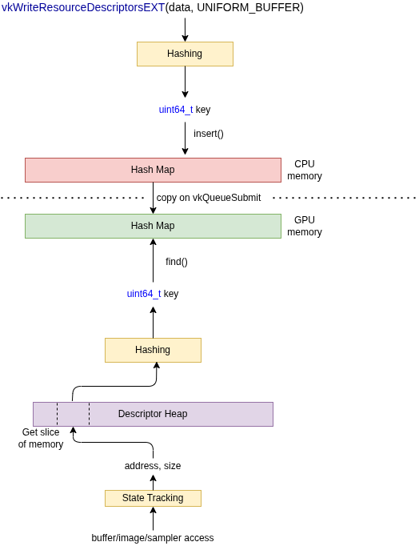
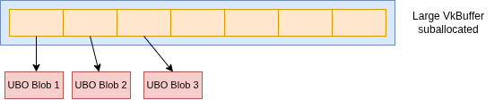

# Descriptor Hashing

The hardest validation to validate for `VK_EXT_descriptor_buffer`/`VK_EXT_descriptor_heap` is if the "descriptor is valid".

The 3 most common cases for not having a valid descriptor are

1. You just forgot to put the descriptor in the heap/buffer.
2. You messed up your pointer math where to access inside the heap/buffer.
3. You mixed up the descriptor type (try loading an image when there is a buffer descriptor)

To detect these, we need to track every descriptor binary and be able to track it back later. Due to high performance cost and memory overhead, this is currently an opt-in setting.

```bash
set VK_LAYER_DESCRIPTOR_HASHING = 1
```

> When descriptor hashing is enabled, it will also work for GPU Dump. This works the same, but we try to view the GPU heap/buffer memory from the CPU at draw/dispatch time. This is not as helpful if the memory is moved into the heap/buffer after recording time.

## Building a Hash Map

We needed a hash map that can `insert` elements on the CPU then be able to `find` them on the GPU.

To make this simpler, we use a statically allocated block of memory that we can then do linear probing over.

To determine the size, we have a `VK_LAYER_DESCRIPTOR_HASHING_TOTAL_DESCRIPTORS` setting that can be adjusted as some users may have many more descriptors than others.

## Workflow

As shown on the diagram below, on the CPU we hash the descriptors as we see them. We make a copy to the GPU per-command buffer at queue submission time. On the GPU we detect the address and if we know it is inside the heap/buffer, we access that memory. We hash the memory on the GPU and then look inside the hash map for it.



## This will leak

Because there is no `VkSampler` or `vkDestroySampler`, any sampler into the hash map will be there forever. There is no way to know when a sampler descriptor is done being used, so we need to track it forever.

## The hash map will get big

It is very common for someone to create a single large `VkBuffer` (let's say 10MB) and then chunk it into smaller 64k UBO descriptors. What this looks like is:



Some apps will even use the large buffer as a ring-buffer each draw. This means having just 1 UBO in a shader can turn into thousands of unique descriptor hashes.

This happens because inside the descriptor binary the driver will likely embed the GPU address and applying a small offset will adjust that final GPU address. Some tools (RenderDoc) have gone as far as trying to reverse engineer some more popular GPU where this address is so that it can collapse these all to the same `VkBuffer` instead of each being their own unique descriptor.

## Descriptors are different sizes

On most devices, the size of a descriptor will be different sizes. Because the hashing takes both an address and a size, this can lead to issues when trying to detect incorrect descriptors used.

An example is if on a device `STORAGE_BUFFER` are `16` bytes while `UNIFORM_BUFFER` are `8` bytes.

If the user put a `STORAGE_BUFFER` at `0x1000` by accident and tries to access it as a `UNIFORM_BUFFER` we want to inform them this is invalid.

The issue occurs when we access `[0x1000, 0x1008]` and has those `8` bytes, it will be a hash never seen. It won't come up as the bad storage buffer unless we access `[0x1000, 0x1010]`

Doing this would require trying to hash every possible known size of descriptors, which we do for `GPU Dump` but don't do for `GPU-AV` currently. This just means we will report "not found" instead of "using the wrong descriptor".

## Debug Names

Now that there are no more handles such as `VkImageView` or `VkSampler` there is a new way to use `VK_EXT_debug_utils` to provide a name to a descriptor.

```c++
VkDebugUtilsObjectNameInfoEXT name_info;
name_info.objectHandle = 0;
name_info.objectType = VK_OBJECT_TYPE_UNKNOWN;
name_info.pObjectName = "My Descriptor Name";

VkSamplerCreateInfo sampler_info;
sampler_info.pNext = &name_info;
vkWriteSamplerDescriptorsEXT(device, 1, &sampler_info, &sampler_host);

VkResourceDescriptorInfoEXT descriptor_info;
descriptor_info.pNext = &name_info;
vkWriteResourceDescriptorsEXT(device, 1, &descriptor_info, &descriptor_host);
```