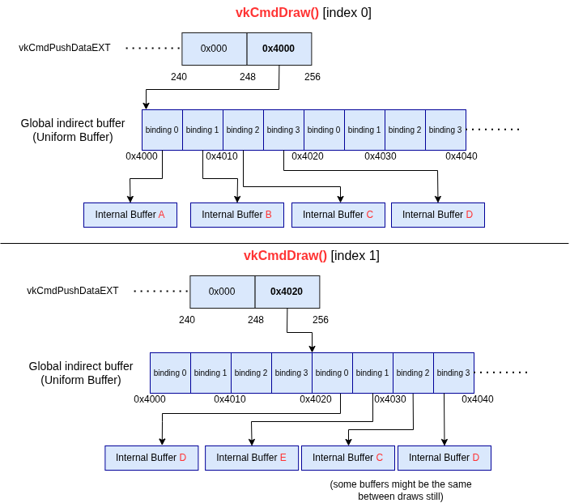
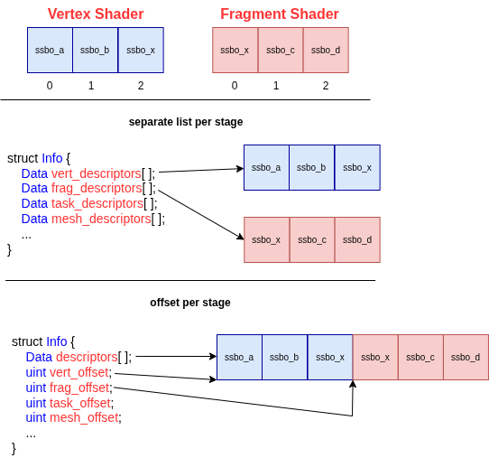

# GPU-AV Descriptor Heap

[Background to read prior to reading this](https://docs.vulkan.org/guide/latest/descriptor_heap.html)

Descriptor Heaps (`VK_EXT_descriptor_heap`) add a whole set of challenges for GPU-AV, and this document walks through the design decisions made.

# Global indirect buffer

Originally, we tried to store our internal descriptors in the heap, but we found that you are allowed to use `VK_EXT_descriptor_heap` without ever binding the heap! (See tests like `NegativeDebugPrintf.DescriptorHeapPushConstantOnly`)

Instead, we decided to use `VK_DESCRIPTOR_MAPPING_SOURCE_HEAP_WITH_INDIRECT_INDEX_EXT` and just have the indirect buffer be our lookup table.

Each time we do a draw/dispatch, we update the address to our bindings.



# Packing Problem

> "Ha you're hitting the classic packing problem" ~Piers (smart driver dev)

When dealing with ShaderObject and Descriptor Heaps you will run into the packing problem.

Imagine you have 2 separate `VkShaderEXT` objects with the following shader interface.

```glsl
// vertex shader
layout(set = 0, binding = 0) buffer ssbo_a { uint a; };
layout(set = 1, binding = 1) buffer ssbo_b { uint b; };
layout(set = 3, binding = 0) buffer ssbo_x { uint x; }; // shared

// fragment shader
layout(set = 3, binding = 0) buffer ssbo_x { uint x; }; // shared
layout(set = 1, binding = 0) buffer ssbo_c { uint c; };
layout(set = 2, binding = 0) buffer ssbo_d { uint d; };
```

Now imagine in our instrumented shaders we want a buffer that looks like:

```c++
// Data from CPU side of GPU-AV that we read/write in our instrumented shaders
struct PassedInData {
    Data descriptor[];
}
```

Here we want a way to index into the `descriptor[]` array. In "classic" mode, we used the `VkDescriptorSetLayout`, which was sorted by the `set`/`binding` and just used the index into the `VkDescriptorSetLayout` as the index into `descriptor[]`.

With heaps, there are no `VkDescriptorSetLayout` and the mappings can't be used as they don't provide which stage, nor if the mapping will be used or not. (Mappings are only used if there is an actual matching descriptor in the shader)

The first thing we need to do is create an algorithm to sort the descriptors in the shader to get an index into `descriptor[]`. There are 2 main options:

1. We can just loop through the SPIR-V binary, set the first unique set/binding combo to `index 0`, and keep incrementing it each time we see a new combo. (It is possible for 2 `OpVariable` declarations to share the same set/binding combo).
2. We use the helper classes we have (like `ResourceInterfaceVariable`) and find all the descriptor variables, and sort by set/binding.

Regardless of how we sort them, eventually we will be at `vkCmdDraw` and will need to create `descriptor[]` for **both** shaders together. From here, we have two options for how to "combine" them:

1. Create 2 `descriptor[]` for each stage
2. Combine them, and have a per-stage offset


