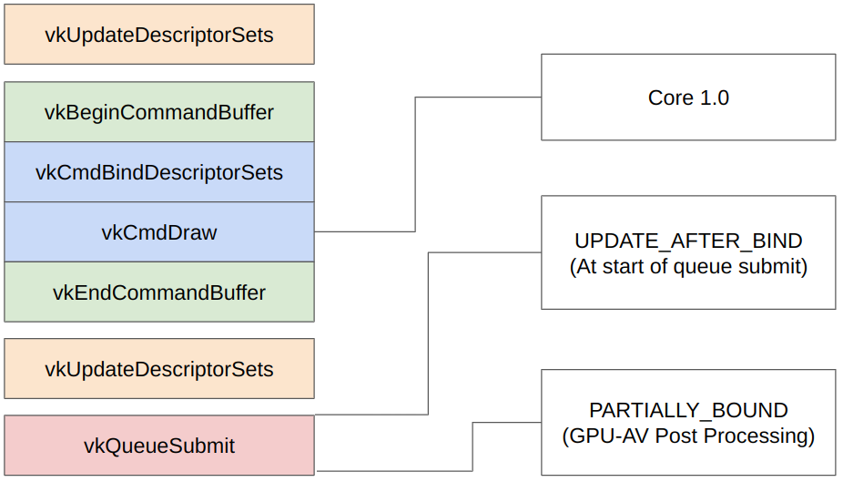

# GPU-AV Descriptor Indexing Validation

To validate the descriptor indexing (sometimes known as `bindless`), we will need to to use GPU-AV as the information is not known until execution time.

## Background

The first part of this documentation is to help educate you around the many ways descriptors can be used in Vulkan. It is needed to understand why things are split up the way they are.

For those who want to understand what the code is doing, skip to the second section [How does GPU-AV descriptor check works](#how-does-gpu-av-descriptor-check-works)

### Array of Descriptors vs Descriptor Array

When talking about "arrays" and "descriptors" it is important to first no mix up the following

```glsl
layout(set = 0, binding = 0) buffer A {
    uint data[]; // All packed in a single VkBuffer
};

layout(set = 0, binding = 0) buffer B {
    uint x;
} Data[]; // An array of VkBuffer
```

The `uint data[];` is actually a known size at runtime, if you use `OpArrayLength` you can get the size of this runtime array while running your shader. This length is determined by the size at `vkUpdateDescriptorSets`.

### OOB crashes regardless of bindless

It is very possible in Vulkan 1.0 to have code such as the following:

```glsl
layout(constant_id = 0) const uint index = 1; // update later to be something like 5

layout(set = 0, binding = 0) buffer foo { uint x; } descriptors[2];

void main() {
    descriptors[index].x = 0;
}
```

This is will crash and we need to do descriptor indexing OOB checks regardless of the use of `VK_EXT_descriptor_indexing` or not.

> Indexing into a descriptor can be done in Vulkan 1.0 as long as the index is a uniform value across all threads in a subgroup. (See features such as `shaderUniformBufferArrayNonUniformIndexing`)

### What does bindless reall mean

The simplest way to think of `bindless` is you can have "uninitialized" and "destroyed" descriptors that you know won't be accessed.

This lets you have code such as the following:

```glsl
if (some_condition_that_will_be_false) {
    descriptors[bad_oob_index].x = 0;
}
```

Without `VK_EXT_descriptor_indexing` at draw time, all descriptors must be valid (via a `vkUpdateDescriptorSets` call) **regardless if they are accessed or not**. This means if you use `descriptors[1]` and not using `VK_EXT_descriptor_indexing` we can validate everything on the CPU.

The `PARTIALLY_BOUND` flag in `VK_EXT_descriptor_indexing` is what allows things to be uninitialized. This means GPU-AV now needs to check something like `descriptors[1]` is not accessing an uninitialized descriptor.

### Null Descriptors

`VK_EXT_robustness2` added a `nullDescriptor` which allows the user to set a descriptor to be `VK_NULL_HANDLE`. Loads from here return zero values and stores are discarded.

So if `descriptors[1]` points a `VK_NULL_HANDLE` we can safely ignore it if `nullDescriptor` is turned on. Without `nullDescriptor` it is invalid to set the descriptor as `VK_NULL_HANDLE` and will be caught on the CPU.

> Warning - Descriptors that are uninitialized are undefined and are not `VK_NULL_HANDLE`

### This occurs without arrays

If we make our shader even simpler

```glsl
layout(set = 0, binding = 0) buffer StorageBuffer {
    uint x;
    uint y;
} Data;

void main() {
    Data.y = 0;
}
```

It is very possible that `vkUpdateDescriptorSets` only bound the first 4 bytes of the `VkBuffer`, therefor this is also now `out-of-bounds` even when dealing with Vulkan 1.0.

With `VK_EXT_descriptor_indexing` there is a possiblity that `PARTIALLY_BOUND` is set `Data` is actually a `VK_NULL_HANDLE`.

What this shows is the fact the descriptor is an array or not, does not matter, we have the same logic for both `out-of-bounds` and `invalid binding` we need to do

We can just think of `Data` as being an implicit array of size 1 (ex `Data[1]`).

### Runtime Descriptors

Going the other side of the spectrum, we might have a runtime array

```glsl
layout(set = 0, binding = 0) buffer StorageBuffer {
    uint x;
} Data[];

void main() {
    uint index = ubo.runtime_value;
    Data[index].x = 0;
}
```

This is not valid in Vulkan 1.0 and if all the accesses to `Data[]` are constants, GLSL/HLSL/etc will just adjust the `Data[]` array to be the length of the highest accessed element.

With `VK_EXT_descriptor_indexing` you can enable `runtimeDescriptorArray` which will allow you actually have a runtime array.

The size of the array is only known by `VkDescriptorSetLayoutBinding::descriptorCount` which can be set up to `vkQueueSumit` and therefor the driver's compiler doesn't know the size. This means we will need to load in the size and can't use something like `OpArrayLength` (which won't work anyways because it will be invalid SPIR-V).

### OOB never happens at front of buffer

When you bind a buffer you set the `range` (size) and `offset` into that `VkBuffer`. This means when validating for `out-of-bounds`, you never need to check the starting range in the descriptor.

```glsl
// NOT possible
layout(set = 0, binding = 0) buffer StorageBuffer {
    uint a; // not-bound
    uint b; // bind 12 bytes from here
    uint c;
    uint d;
};
```

### Texel Buffers and Storage Images

The above examples are all dealing with Uniform/Storage buffers.

Texel Buffer (and Storage Image via `OpImageFetch`) work the same way as buffers, you can have `out-of-bounds` for both array and non-array descriptors

```glsl
layout(set = 0, binding = 0, Rg32ui) uniform uimageBuffer tb_non_array;
layout(set = 0, binding = 1, Rg32ui) uniform uimageBuffer tb_array[2]; // could be runtime array as well

// coordinate could be OOB
imageStore(tb_non_array, coordinate, data);

// index into array could be OOB or not bound
imageStore(tb_array[1], coordinate, data);
```

### Sampled Images

Images are different as they can't have an `out-of-bounds` when sampled because the sampler will use `VkSamplerAddressMode` to determine what to get if the UV coordinate is OOB

```glsl
layout(set = 0, binding = 0) uniform sampler2D tex_non_array;
layout(set = 0, binding = 1) uniform sampler2D tex_array[6]; // could be runtime array as well

// When using `PARTIALLY_BOUND` these might not be bound and need to validate
texture(tex_non_array, uv);
texture(tex_array[3], uv);
```

### When we validate

The following is a break down of "when" we can validate descriptors:



All 3 spots should run the same "validate descriptor" logic

The big thing to take from here is that `UPDATE_AFTER_BIND` doesn't mean we need to validate on the GPU, but **can** be done on the CPU if desired, but not until vkQueueSubmit is called.

The core reason we do **not** validate for `UPDATE_AFTER_BIND` on the CPU is some application (most notably Doom Eternal) will have 1 million descriptors (and not use `PARTIALLY_BOUND`). The time to check all of these on the CPU is a huge bottle neck and is better to just validate the accessed descriptors detected on the GPU.

### Static vs Dynamically used

The ugly part of the spec starts when you get to when things are "statically used" or not

```glsl
layout(set = 0, binding = 0) buffer StorageBuffer {
    uint x;
} Data[2];

void main() {
    // will for sure run
    Data[1].x = 0;

    if (some_condition) {
        // might not get here
        Data[3].x = 0;
    }
}
```

In the above shader, in theory, this could be valid if the user never enters `if (some_condition)` where an invalid access will occur.

Instead of dealing with some theoretical edge cases or trying to validate some things on the CPU vs GPU, the following is used to make things simpler for everyone:

- If `PARTIALLY_BOUND` or `UPDATE_AFTER_BIND` are used, move all work to GPU
- If `PARTIALLY_BOUND` and `UPDATE_AFTER_BIND` are **not** used, `Data` is accessed with a constant, validate that element is bound on the CPU.
- If `PARTIALLY_BOUND` and `UPDATE_AFTER_BIND` are **not** used, `Data` is accessed with a non-constant, we check all elements are bound on the CPU.
    - Even if user "knows" what the non-constant will be, it is invalid, they need to use descriptor indexing!

> `accessed` means there is a load/store/atomic on it in any function, even if that function is never called by the main function. If the `spirv-opt` wasn't used there might be a ghost binding declared, but never used, this is a case of not being an access.
>
> There is a `GL_EXT_nonuniform_qualifier`/`SPV_EXT_descriptor_indexing` that allows to use `NonUniform` to access things, this interaction is taken care with `spirv-val` as it will requires various features found in `VkPhysicalDeviceDescriptorIndexingFeaturesEXT`

### 2 kinds of dynamic array

There are `descriptor arrays` and `access arrays`, best described with

```glsl
layout(set = 0, binding = 0) buffer StorageBuffer {
    uint x;
} Data[2]; // descriptor array

void main() {
    // access array
    Data[index].x = 0;
}
```

This is imporant to distinguish when dealing with code as it will be referencing both and can be easy to mix up.

### Robustness

> Details about robustness itself can be found at https://docs.vulkan.org/guide/latest/robustness.html

We will be using Robustness to let GPU-AV make optimizations because we know things won't suddenly crash on us.

One of the main reason to break-up changes between bindless vs non-bindless is because of what robustness in Vulkan covers

From Vulkan 1.0 we can use `robustBufferAccess` to check for `out-of-bounds` for non-bindless checks

When dealing with bindless and invalid descriptors we will need to use `robustBufferAccess2`/`robustImageAccess2`

## How does GPU-AV descriptor check works

The descriptor checks in GPU-AV are done in 3 parts

1. Descriptor Indexing OOB
2. Descriptor Class
3. Post Processing

### Descriptor Indexing OOB

To prevent crashing, no matter what, we **must** wrap all indexes into a descriptor with a `if/else`. Because non-bindless doesn't have to worry about descriptors being  uninitialized and destroyed it is a much simpler check.

The GLSL (`descriptor_indexing_oob_bindless.comp`/`descriptor_indexing_oob_non_bindless.comp`) will look like the following when applied:

```glsl
if (inst_descriptor_indexing_oob_bindless(index)) {
    descriptor[index] = 0;
}

// or

if (inst_descriptor_indexing_oob_non_bindless(index)) {
    descriptor[index] = 0;
}
```

### Descriptor Class

One we have indexed into the descriptor array, we must make sure the descriptor itself is being accessed correctly. Buffers, Images, Acceleration Structure, etc wll all have different rules how accessing it is valid or not.

The main thing is **all** of these can prevented from crashing using one of the various robustness features (that we will enable for the user for them). This means we can apply the check without needing the `if/else`.

There should be a Descriptor Class check for each of the `vvl::DescriptorClass` enums and look like the following

```glsl
// From descriptor_class_general_buffer.comp
inst_descriptor_class_general_buffer(index, offset_to_value_inside);
ssbo_descriptor[index].value_inside = 0;

// From descriptor_class_texel_buffer.comp
inst_descriptor_class_texel_buffer(index, offset_to_value_inside);
texel_buffer_descriptor[index].value_inside = 0;
```

### Post Processing

The final step is once we know which descriptor was accessed, we can run the normal "core validation" on the descriptor. There is a Post Process buffer that will write which indexes are accessed and after the `vkQueueSubmit` a timeline semaphore will validate it on the CPU.

the GLSL (`post_process_descriptor_index.comp`) will look like

```glsl
inst_post_process_descriptor_index(index);
descriptor[index].value_inside = 0;
```

### Putting it all together

With these 3 parts the following GLSL

```glsl
layout(set=0, binding=0) uniform foo { uint index; };
// assume not using bindless
layout(set=0, binding=1) buffer foo { uint value_inside; } bar[2];
void main() {
    bar[index].value_inside = 0;
}
```

will end up looking like the following

```glsl
void main() {
    if (inst_descriptor_indexing_oob_non_bindless(index)) {
        inst_descriptor_class_general_buffer(index, 4); // 4 bytes into SSBO accessed
        inst_post_process_descriptor_index(index);
        bar[index].value_inside = 0;
    }
}
```
