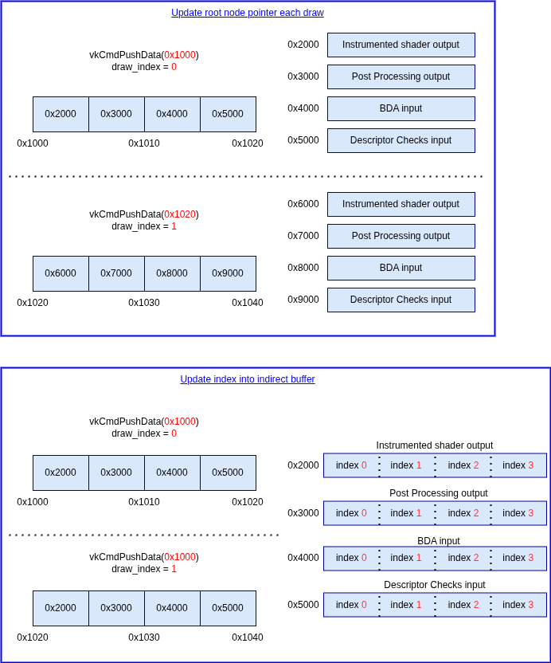

# GPU-AV Internal Descriptor

GPU-AV works by being able to communicate data between the CPU and the instrumented shaders on the GPU.

To do this, GPU-AV needs to inject a descriptor (storage buffer) into the shader. This provides both **input data** used to do the validation logic, and **output data** to store the error messages to report.

It is really important that we update the descriptor **every** draw/dispatch/traceRay call.

One reason is that the shaders bound at each draw call will likely be different, meaning we will want to update it.

The other main reason is if the user goes:

```c++
VkDebugUtilsLabelEXT label = vku::InitStructHelper();
label.pLabelName = "Section 1";
vkCmdBeginDebugUtilsLabelEXT(&label);
// ...
vkCmdDraw();
vkCmdEndDebugUtilsLabelEXT();

label.pLabelName = "Section 2";
vkCmdBeginDebugUtilsLabelEXT(&label);
vkCmdDraw();
vkCmdEndDebugUtilsLabelEXT();
```

We need to be able to tell them which debug region their error occurred from.

Currently, our approach for this is to just create a buffer that looks like

`[0, 1, 2, 3, 4, ...., gpuav_settings.invalid_index_command (default of 8k)]`

and at each draw/dispatch, we increase the `action_command_index` and use that to offset into this buffer.

## Root Node

When doing this per-draw design, the solution will take the form of having a single "root node" (device address) that references the lookup table of items.

The issue occurs when you realize there are 2 different ways to go about this.

1. Per-draw, update the address to a different indirect lookup table.
2. Per-draw, keep a single address, and update the index into the buffer.



If you do a single address (option 2) you could speed up the first lookup by injecting that address as a spec constant in every specialized shader. The main down side is you will never know how much to allocate for the other buffers. While some things, such as the `Instrumented Shader output`, we might have a set size, the `BDA Input` buffer will be a variable size depending on what the application provides.

Option 2 should be faster, but will likely consume a lot more memory.

## Classic Descriptors

With Vulkan 1.0 style descriptors, this is done by stealing the last descriptor set slot from the user. So if the driver exposed `maxBoundDescriptorSets == 8`, then GPU-AV will tell the app the real `maxBoundDescriptorSets` is actually `7` and use that final slot to inject the descriptor.

## Descriptor Buffer

For `VK_EXT_descriptor_buffer`, GPU-AV will bind a separate descriptor buffer in the command buffer. See [design doc for details](./gpu_av_descriptor_buffer.md).

## Descriptor Heap

For `VK_EXT_descriptor_heap`, we make use of `VK_DESCRIPTOR_MAPPING_SOURCE_HEAP_WITH_INDIRECT_INDEX_EXT`. See [design doc for details](./gpu_av_descriptor_heap.md).
