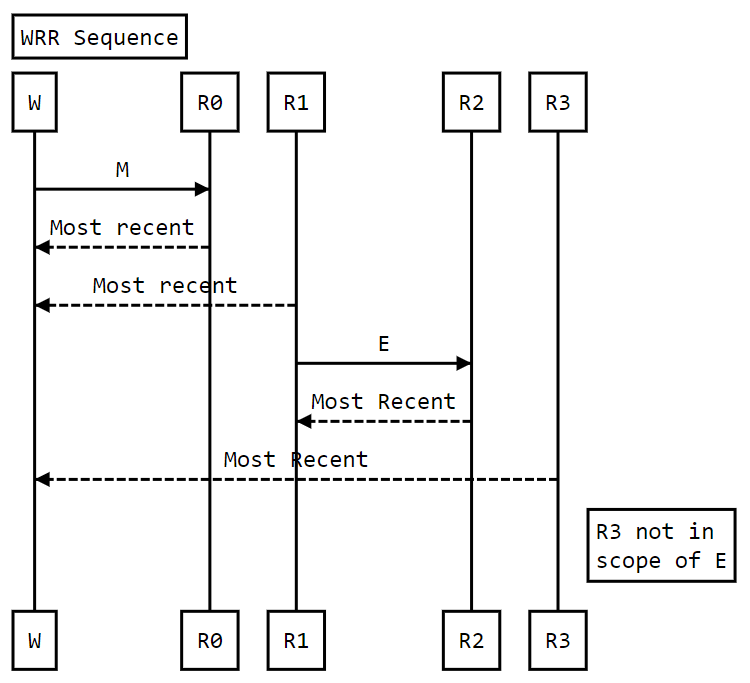
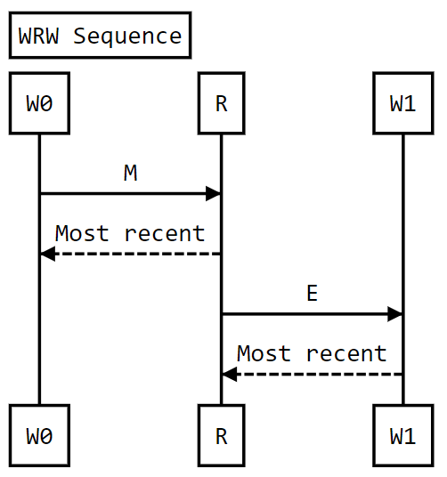

<!-- markdownlint-disable MD041 -->
<!-- Copyright 2015-2023 LunarG, Inc. -->
[![Khronos Vulkan][1]][2]

[1]: https://vulkan.lunarg.com/img/Vulkan_100px_Dec16.png "https://www.khronos.org/vulkan/"
[2]: https://www.khronos.org/vulkan/

# Synchronization Validation Design Documentation (phase1 release)

Authors: Tobin Ehlis, John Zulauf


[TOC]


## Overview

The Vulkan API features a number of unique synchronization primitives to express execution and memory dependencies and currently validation only has limited support for tracking fence and semaphore primitives.  


Execution and memory dependencies are used to solve data hazards, i.e. to ensure that read and write operations occur in a well-defined order. Write-after-read hazards can be solved with just an execution dependency, but read-after-write and write-after-write hazards need appropriate memory dependencies to be included between them. If an application does not include dependencies to solve these hazards, the results and execution orders of memory accesses are undefined.

This document is intended to outline a design that will unify the tracking of all Vulkan memory accesses and synchronization primitives within Vulkan Validation. Such a model will enable flagging error cases where synchronization primitives are missing, but also allow for visualization of such primitives and provide for recommendations on optimal use of synchronization for any given combination of Vulkan commands and resources.

The pipelined and multi-threaded nature of Vulkan makes it particularly important for applications to correctly insert needed synchronization primitives, and for validation to diagnose unprotected hazards.  These hazards are:


<table>
  <tr>
   <td>RAW
   </td>
   <td>Read-after-write
   </td>
   <td>Occurs when a subsequent operation uses the result of a previous operation without waiting for the result to be completed.
   </td>
  </tr>
  <tr>
   <td>WAR
   </td>
   <td>Write-after-read
   </td>
   <td>Occurs when a subsequent operation overwrites a memory location read by a previous operation before that operation is complete. (requires only execution dependency)
   </td>
  </tr>
  <tr>
   <td>WAW
   </td>
   <td>Write-after-write
   </td>
   <td>Occurs when a subsequent operation writes to the same set of memory locations (in whole or in part) being written by a previous operation.
   </td>
  </tr>
  <tr>
   <td>WRW
   </td>
   <td>Write-racing-write
   </td>
   <td>Occurs when unsynchronized subpasses/queues perform writes to the same set of memory locations.
   </td>
  </tr>
  <tr>
   <td>RRW
   </td>
   <td>Read-racing-write
   </td>
   <td>Occurs when unsynchronized subpasses/queues perform read and write operations on the same set of memory locations
   </td>
  </tr>
</table>


## Algorithmic Overview

### Approach

In order to validate synchronization the effect of action and synchronization commands must be tracked.  The full validation can *only* be done at queue submission time, when the full context of the command batches is known. However, partial validation of hazards knowable within the context of a single recorded command buffer can be done at record time at. This partial validation includes record time detection of internally present hazards during sub-pass and can be extended to include secondary command buffer execution. To support this usage, the validation and update components must be designed to operate at record, secondary command buffer execute record, and queue submit time.

 Synchronization validation centers around examining the previous access and synchronization operations for a range of memory addresses against a current access or operation against that same range. The _state_ (Resource Access State) tracks the most recent read, write, and synchronization operations for a given range of memory addresses. These are captured in contexts (Access Context) which reflect the Queue, Command Buffer, or Subpass instance in which the memory accesses were made. This first approach is sufficient for single command buffer validation. Note that only the most recent state (relative to *write* operations)  is retained. Additionally, the “dependency chain” logic can be represented by a cumulative state reflecting the impact of all synchronization operations on the most recent read/write state. Between the _state_ and _context_, enough information is present to do record time validation of single command buffers.

### Most Recent Access

When detecting memory access hazards, synchronization validation considers only the most recent access (MRA) for comparison. All prior hazards are assumed to have been reported.

For read operations the most recent access rules apply to prior reads with execution barriers (or ordering) relative to the current read. The prior write access is only considered the most recent access if no intervening prior read has occurred that *happens-before* the current read. Consider the following sequence of access and barriers (listed in submission order) acting on the same memory address:


| Operation | Description                                                  |
| --------- | ------------------------------------------------------------ |
| W         | write operation                                              |
| M         | memory barrier guarding access at R0                         |
| R0        | first read operation                                         |
| R1        | second read operation                                        |
| E         | execution barrier s.t. R2 *happens-after R1*                 |
| R2        | third read operation                                         |
| R3        | fourth read operation with stage not in second execution scope of E |



For write hazard checks in a given range of memory addresses, if there are intervening read operations between the current write and the most recent previous write, these intervening read operations are considered the most recent access. In that case, write-after-write checks are not done. 

Consider the following sequence of operations one the same memory address:

| Operation | Description                             |
| --------- | --------------------------------------- |
| W0        | first write operation                   |
| M         | memory barrier guarding access at R     |
| R         | read access                             |
| E         | execution barrier guarding access at W1 |
| W1        | second write operation                  |



In this case, a read-after-write check is done for R based on W0 and M, and a write-after-read check is performed on W1 based on R and E. W1 is not checked against W0 for write-after-write. If W0, M, R **is** not a hazard, this guarantees W0 is available and visible to R, and thus to any operations that *happen-after*. As such, the correctness of R, E, W1 depends solely on those operations. The correctness of the entire sequence can be assured by pairwise hazard checks.

### Tracking Across Command Buffers

For multiple command buffers/secondary buffers, a partial recording of memory accesses and synchronization operations is required.  Current design targets the use of storing the “first” access information (first reads, first write), along with the either a recording of all synchronization operations *or* some "barrier state" that can be stored with each “first access”.  This approach should be familiar to those that have seen the “image layout” queue-submit, and execute-command validation, which validates against a similar “first” record.

Overall the operations to perform include

*   Access/operation validation against current state.  This involves lookup of the affected state, potentially traversing a context tree or barrier record, and then comparing the access relative to the state -- i.e. the previous read and/or write operations in light of the synchronization operations recorded in the state
*   Reporting detected hazard
*   Updating the current state to reflect the access or operation.

Additionally

*   Traversal of context trees/barrier replay (or reconstruction)
*   Initialization (import) or Resolution (export) of access contexts to parent or subsequent contexts


## Memory Access Storage

Memory access is characterized by the _memory extent_ and _memory usage_.  Memory extent described the memory affected including the `VkMemory` handle, offset, size, and (for images) subresource range. The memory usage describe the pipeline stage (`VkPipelineStageFlagBits`) and memory access (`VkAccessFlagBits`) -- for example “vertex shader stage / shader read”.  A memory access only describes a single usage for a given extent.


### Memory Address Space

To simplify tracking and updating the state of memory extents as listed below, state is stored in a consistent way for all resource types. Also, to eliminate needing to define separate address spaces for each device memory allocations, VkMemory are placed at “fake” base addresses (FBA) within a global address space using a simple “next available” allocation scheme. (Which is robust for all rational Vulkan usage models for months of runtime.) Additionally, because the actual memory organization of certain resources is opaque, an "opaque range" is allocated with an independent FBA to the extent needed to hold the Synchronization Validation internal representation of these opaque resources. 


### Memory Extent Definitions and Comparisons

Memory extent can be specified in a variety of ways:

<table>
  <tr>
   <td>Memory range
   </td>
   <td>A range of addresses within either <code>VkDeviceMemory</code> allocation offset within the "fake" address space, referencing a specific device memory range (i.e. a "linear range"), or a range of "fake" address space represention a portion of the Synchronization Validation representation of a tiled image or other opaquely represented device resource (i.e. an "opaque range").  All accesses to a given resource are contained within the linear range(s) of the `VkDeviceMemory`(s) to which it is bound, or within the opaque range representing the resource.
   </td>
  </tr>
  <tr>
   <td>Linear (transparent) image subresource range
   </td>
   <td>A <code>VkImage</code> handle for transparent (linear tiling) image with a <code>VkSubresourceRange </code>are mapped to the (potentially non contiguous) memory ranges of the <code>VkMemory </code>bound to the VkImage for each subresource within the range.
   </td>
  </tr>
  <tr>
   <td>Tiled (opaque) image subresource range
   </td>
   <td>A VkImage handle to an opaque (optimal tiling) image with a VkSubresourceRange which cannot be mapped to a specific subset of the the <code>VkMemory </code>bound to the <code>VkImage</code>.  The subresources are encoded to the opaque range reserved for the resource, specific to the image creation parameters which can only be compared relative to “compatible” aliases.  Otherwise all subresources within the range are assumed to alias to *every* device memory address bound to the image.
   </td>
  </tr>
  <tr>
   <td>Sparsely bound Extents
   </td>
   <td>TBD
   </td>
  </tr>
</table>


These distinctions affect the ability of memory references to be compared w.r.t. “overlap” --

<table>
  <tr>
   <td>For same memory handle
   </td>
   <td>Memory range
   </td>
   <td>Linear Image
   </td>
   <td>Tiled Image
   </td>
  </tr>
  <tr>
   <td>Memory range
   </td>
   <td>Compare range
   </td>
   <td>Encode subresource range to memory range and compare..
   </td>
   <td>Compare memory range to all accesses within image binding memory range.
   </td>
  </tr>
  <tr>
   <td>Linear Image
   </td>
   <td>
   </td>
   <td>Encode subresource range to memory range and compare.
   </td>
   <td>Compare memory range to all accesses within image binding memory range.
   </td>
  </tr>
  <tr>
   <td>Tiled image (Opaque Resources)
   </td>
   <td>
   </td>
   <td>
   </td>
   <td>For “compatible*” tiled images (or other opaque resources), compare encoded opaque ranges.  For incompatible images, every subresource is assumed to alias to all subresources of the other image.
   </td>
  </tr>
</table>


* Compatible tiled images are those with same image resource handle, or with the same image create info with `VK_IMAGE_CREATE_ALIAS_BIT ` set and the same `VkDeviceMemory` and binding offset.

For incompatible memory extent types any overlap of the bound range must be assumed to be an overlap of the entire bound range (and thus all subresource ranges).  Note: looking for binding range overlap is a likely important first step before doing more detailed overlap analysis.  Also, as a lower precision option, any comparison of non-similar resources (offset or create info) could revert to the opaque “tiled” case for linear images.


### Algorithmic Aside: Interval Trees

Several of the lookups below require tracking and comparing non-unique collections of intervals (memory binding range, mip levels or slices in a subresource).  To compress storage improve traversal of the access state these intervals are stored in non-overlapping interval trees -- effectively a run-length compression for ranges of memory addresses over which the state is constant.

The implementation used is a wrapper to std::map (which is typically implemented as a red-black tree), that implements a non-overlapping 1 dimensional range map.  Conversion to and from subresource address space is performed by a “encoder”/”generator” classes the create a set of single-dimensional ranges from subresource range definitions.  For buffer and linear images, the index for the interval tree represents device memory in an simplified memory allocation scheme for VkDeviceMemory allocations.  For tiled/opaque images, the index represents an opaque memory range, not corresponding to device memory in any way.

### VK_KHR_synchronization2

Synchronization validation uses the pipeline stages and access masks defined in this extension, even when the extension is not enabled.  This is mostly transparent to the user, except that a few pipeline stages and access masks are split, to give more fine grained visibility into the  pipeline. This lets the validation code give better output in some cases. For example, a hazard caused by a vkCmdCopy() command will record its access as COPY_TRANSFER_READ or COPY_TRANSFER_WRITE, rather than TRANSFER_TRANSFER_READ or TRANSFER_TRANSFER_WRITE. A pipeline barrier using VK_PIPELINE_STAGE_TRANSFER_BIT should still fix this hazard.

For convenience,  the tables below show the pipeline stages and access masks affected:

| Vulkan 1.2 Pipeline Stage          | Synchronization2 Pipeline Stages                             |
| ---------------------------------- | ------------------------------------------------------------ |
| VK_PIPELINE_STAGE_TRANSFER_BIT     | VK_PIPELINE_STAGE_2_COPY_BIT_KHR				VK_PIPELINE_STAGE_2_RESOLVE_BIT_KHR				VK_PIPELINE_STAGE_2_BLIT_BIT_KHR				VK_PIPELINE_STAGE_2_CLEAR_BIT_KHR |
| VK_PIPELINE_STAGE_VERTEX_INPUT_BIT | VK_PIPELINE_STAGE_2_INDEX_INPUT_BIT_KHR 				    VK_PIPELINE_STAGE_2_VERTEX_ATTRIBUTE_INPUT_BIT_KHR |


| Vulkan 1.2 Access Mask     | Synchronization2 Access Masks                                |
| -------------------------- | ------------------------------------------------------------ |
| VK_ACCESS_SHADER_READ_BIT  | VK_ACCESS_2_SHADER_SAMPLED_READ_BIT_KHR VK_ACCESS_2_SHADER_STORAGE_READ_BIT_KHR |
| VK_ACCESS_SHADER_WRITE_BIT | VK_ACCESS_2_SHADER_STORAGE_WRITE_BIT_KHR                     |

   These stages also affect the Stage / Access map described in the next section.

 

### Memory Usage Specification

Vulkan classifies memory access by pipeline stage and access. However for purposes of tracking specific access, availability, and visibility state changes the two masks would allow for aliasing that could hide hazards.   In order to avoid that aliasing, the valid combinations of Stage and Access flags can be combined into memory usages-- with each represented by a unique index (currently 79 valid combinations) )and tracked with single bit within a mask(list in roughly pipeline order). 

<table>
  <tr>
   <td>Stage
   </td>
   <td>Stage/Access
   </td>
  </tr>
  <tr>
   <td>Draw Indirect
   </td>
   <td> DRAW_INDIRECT_INDIRECT_COMMAND_READ<br>
        DRAW_INDIRECT_TRANSFORM_FEEDBACK_COUNTER_READ_EXT
   </td>
  </tr>
  <tr>
   <td>Index Input
   </td>
   <td> INDEX_INPUT_INDEX_READ
   </td>
  </tr>
  <tr>
 </tr>
  <tr>
   <td>Vertex Attribute Input
   </td>
   <td>
        VERTEX_ATTRIBUTE_INPUT_VERTEX_ATTRIBUTE_READ
   </td>
  </tr>
  <tr>
   <td>Vertex Shader
   </td>
   <td> VERTEX_SHADER_SHADER_READ<br>
        VERTEX_SHADER_ACCELERATION_STRUCTURE_READ<br>
       VERTEX_SHADER_SHADER_SAMPLED_READ<br>
       VERTEX_SHADER_SHADER_STORAGE_READ<br>
       VERTEX_SHADER_SHADER_STORAGE_WRITE<br>
       VERTEX_SHADER_UNIFORM_READ
   </td>
  </tr>
  <tr>
   <td>Tessellation Control
   </td>
   <td> TESSELLATION_CONTROL_SHADER_ACCELERATION_STRUCTURE_READ<br>
        TESSELLATION_CONTROL_SHADER_SHADER_SAMPLED_READ<br>
        TESSELLATION_CONTROL_SHADER_SHADER_STORAGE_READ<br>
        TESSELLATION_CONTROL_SHADER_SHADER_STORAGE_WRITE<br>
        TESSELLATION_CONTROL_SHADER_UNIFORM_READ
   </td>
  </tr>
  <tr>
   <td>Tessellation Evaluation
   </td>
   <td> TESSELLATION_EVALUATION_SHADER_ACCELERATION_STRUCTURE_READ<br>
        TESSELLATION_EVALUATION_SHADER_SHADER_SAMPLED_READ<br>
        TESSELLATION_EVALUATION_SHADER_SHADER_STORAGE_READ<br>
        TESSELLATION_EVALUATION_SHADER_SHADER_STORAGE_WRITE<br>
        TESSELLATION_EVALUATION_SHADER_UNIFORM_READ
   </td>
  </tr>
  <tr>
   <td>Geometry Shader
   </td>
   <td> GEOMETRY_SHADER_ACCELERATION_STRUCTURE_READ<br>
        GEOMETRY_SHADER_SHADER_SAMPLED_READ<br>
        GEOMETRY_SHADER_SHADER_STORAGE_READ<br>
        GEOMETRY_SHADER_SHADER_STORAGE_WRITE<br>
        GEOMETRY_SHADER_UNIFORM_READ
   </td>
  </tr>
  <tr>
   <td>Transform Feedback
   </td>
   <td> TRANSFORM_FEEDBACK_BIT_EXT_TRANSFORM_FEEDBACK_COUNTER_READ_BIT_EXT<br>
        TRANSFORM_FEEDBACK_BIT_EXT_TRANSFORM_FEEDBACK_COUNTER_WRITE_BIT_EXT<br>
        TRANSFORM_FEEDBACK_BIT_EXT_TRANSFORM_FEEDBACK_WRITE_BIT_EXT
   </td>
  </tr>
  <tr>
   <td>Fragment Density
   </td>
   <td>FRAGMENT_DENSITY_PROCESS_EXT_FRAGMENT_DENSITY_MAP_READ_EXT
   </td>
  </tr>
  <tr>
   <td>Task Shader
   </td>
   <td> TASK_SHADER_NV_ACCELERATION_STRUCTURE_READ<br>
        TASK_SHADER_NV_SHADER_SAMPLED_READ<br>
        TASK_SHADER_NV_SHADER_STORAGE_READ<br>
        TASK_SHADER_NV_SHADER_STORAGE_WRITE<br>
        TASK_SHADER_NV_UNIFORM_READ
   </td>
  </tr>
  <tr>
   <td>Mesh Shader
   </td>
   <td> MESH_SHADER_NV_ACCELERATION_STRUCTURE_READ<br>
        MESH_SHADER_NV_SHADER_SAMPLED_READ<br>
        MESH_SHADER_NV_SHADER_STORAGE_READ<br>
        MESH_SHADER_NV_SHADER_STORAGE_WRITE<br>
        MESH_SHADER_NV_UNIFORM_READ
   </td>
  </tr>
  <tr>
   <td>Shading Rate
   </td>
   <td>
   FRAGMENT_SHADING_RATE_ATTACHMENT_FRAGMENT_SHADING_RATE_ATTACHMENT_READ
   </td>
  </tr>
  <tr>
   <td>Early Fragement Tests
   </td>
   <td> EARLY_FRAGMENT_TESTS_DEPTH_STENCIL_ATTACHMENT_READ<br>
        EARLY_FRAGMENT_TESTS_DEPTH_STENCIL_ATTACHMENT_WRITE
   </td>
  </tr>
  <tr>
   <td>Fragment Shader
   </td>
   <td> FRAGMENT_SHADER_ACCELERATION_STRUCTURE_READ <br>
        FRAGMENT_SHADER_INPUT_ATTACHMENT_READ<br>
        FRAGMENT_SHADER_SHADER_SAMPLED_READ<br>
        FRAGMENT_SHADER_SHADER_STORAGE_READ<br>
        FRAGMENT_SHADER_SHADER_STORAGE_WRITE<br>
        FRAGMENT_SHADER_UNIFORM_READ
   </td>
  </tr>
  <tr>
   <td>Late Fragment Tests
   </td>
   <td>
        LATE_FRAGMENT_TESTS_DEPTH_STENCIL_ATTACHMENT_READ<br>
        LATE_FRAGMENT_TESTS_DEPTH_STENCIL_ATTACHMENT_WRITE
   </td>
  </tr>
  <tr>
   <td>Color Attachment Output
   </td>
   <td>
        COLOR_ATTACHMENT_OUTPUT_COLOR_ATTACHMENT_READ<br>
        COLOR_ATTACHMENT_OUTPUT_COLOR_ATTACHMENT_READ_NONCOHERENT_EXT<br>
        COLOR_ATTACHMENT_OUTPUT_COLOR_ATTACHMENT_WRITE
   </td>
  </tr>
  <tr>
   <td>Compute Shader
   </td>
   <td>
        COMPUTE_SHADER_ACCELERATION_STRUCTURE_READ<br>
        COMPUTE_SHADER_SHADER_SAMPLED_READ<br>
        COMPUTE_SHADER_SHADER_STORAGE_READ<br>
        COMPUTE_SHADER_SHADER_STORAGE_WRITE<br>
        COMPUTE_SHADER_UNIFORM_READ
   </td>
  </tr>
  <tr>
   <td>Copy
   </td>
   <td>
        COPY_TRANSFER_READ<br>
        COPY_TRANSFER_WRITE
   </td>
  </tr>
  <tr>
   <td>Resolve
   </td>
   <td>
        RESOLVE_TRANSFER_READ<br>
        RESOLVE_TRANSFER_WRITE
   </td>
  </tr>
  <tr>
   <td>Blit
   </td>
   <td>
        BLIT_TRANSFER_READ<br>
        BLIT_TRANSFER_WRITE
   </td>
  </tr>
  <tr>
   <td>Clear
   </td>
   <td>
        CLEAR_TRANSFER_WRITE
   </td>
  </tr>
  <tr>
   <td>Command Preprocess
   </td>
   <td>
        COMMAND_PREPROCESS_NV_COMMAND_PREPROCESS_READ_NV<br>
        COMMAND_PREPROCESS_NV_COMMAND_PREPROCESS_WRITE_NV
   </td>
  </tr>
  <tr>
   <td>Host Memory Access
   </td>
   <td>
        HOST_HOST_READ<br>
        HOST_HOST_WRITE
   </td>
  </tr>
  <tr>
   <td>Barrier operations
   </td>
   <td>
        IMAGE_LAYOUT_TRANSITION<br>
        QUEUE_FAMILY_OWNERSHIP_TRANSFER
   </td>
  </tr>
</table>

Note that of interest is also the “pipeline type” (compute, graphics, or transfer) of the action causing this memory access. It is needed when determining logically “earlier” and “later” stages of the pipeline for apply synchronization scope updates. This information is code-generated from parsing of the Vulkan specification, with appropriate snippets *manually* update within the code generation scripts.


### Access Scopes

Within the specification the scope of effect for synchronization operations is characterized differently for execution and memory access.  Execution scopes are _expanded _to include logically earlier stage for “source” (or “first”) execution scopes, and logically later for “second” (or “destination”) execution scopes. Validation and update operations perform meta-stage substitution of `VK_PIPELINE_STAGE_ALL_COMMANDS_BIT `and  `VK_PIPELINE_STAGE_ALL_GRAPHICS_BIT `prior to stage expansion.

The scope of memory access is instead _restricted_ to the set of accesses both legal for the execution scope as _provided_ to the synchronization operation and within the mask of access types to be included.  Prior to any validation or update operations as described in subsequent sections, this _expansion_ or _restriction _is performed yielding _source execution scope, source access scope, destination execution scope, and destination access scope _which are encoded as bitmasks (encoding stage and stage/access appropriately)._._


## State Tracking


### Data Structures

#### ResourceUsageTag

A marker representing a specific access for error reporting or sequence specific operations.

#### ResourceAccessState

The specific access/barrier state for a given extent of memory (or opaque range) addresses. The `ResourceAccessState` reflects the common state of a single contiguous range of "fake" addresses.

Stores:

*   Write usage -- information about most recent write usage for the memory range
    *   State/Access of usage. Updated on write
    *   Write barriers -- the destination stage/access pairs which are _non-hazardous_ to the last write.  Cleared on write.
    *   Memory access synchronization chain mask.  Tracks the stages for which barriers applying to the write usage. Cleared on write.
    *   Aggregated Read Execution Barriers -- all stages in the second synchronization scope of all barriers applied to read accesses since the last write  (used for read-after-write testing). Cleared on write.
    *   Usage tag. Updated on write
    *   Queue Id: The queue on which the access was made. Set at queue submit time.
    *   None cleared by read operations
*   read usage  -- Per stage, All cleared on write operations
    * Stage/Access of usage.  Updated on stage read
    * Execution (read) barriers -- the union of destination execution scopes for synchronization operations affecting this read at this stage. Cleared at read operation for this stage.
    * Sync stages -- all read stages that have synchronously executed after this stage Cleared at read operation for this stage.
    * Queue Id: The queue on which the access was made. Set at queue submit time. 
    * Usage Tag. Updated on on stage read

Implements:

*   Hazard detection functions
*   State update/resolution operations
*   Wait operations

Queue Id and Sync stages are used for semaphore, queue, and fence wait operations, and for synchronization operation replay at queue submit time.

#### ResourceAccessRangeMap 

#### ResourceAccessRangeMap 

Interval tree of ResourceAccessState records within the unified "fake" address space, comprising VkDeviceMemory linear ranges and opaque ranges

#### AccessContext

ResourceAccessState and dependency information for a given “context” (for example within a given command buffer, but outside a renderpass, or within a given subpass of a renderpass instance)

Stores:

*   "Fake"address space ResourceAccessRangeMap
*   Subpass dependency and barrier information (for traversal within renderpass instances) if needed.

Implements:

*   Hazard detection traversal over (potentially discontiguous) ranges for images and buffers
*   VkMemory FBA offset
*   State update traversal over (potentially discontiguous) ranges for images and buffers
*   Subpass dependency graph traversal for state lookup and resolution operations (including support  for RenderPass specific and Hazard detection operations)
*   Range map operations to split (and potentially combine) ResourceAccessState records, to ensure state changes only impact the correct portion of the address space.

#### CommandBufferAccessContext

container for all access contexts for a specific command buffer, and state reflecting the current context.  

Stores:

*   Command buffer state pointer (saves StateTracker lookup)
*   AccessContext for all outside-renderpass-instance operations
*   RenderPassAccessContext

Implements:

*   RenderPass instance operations top level begin/next/end operations (calling RenderPassAccessContext operations)

#### RenderPassAccessContext

Manages the current access context and context transitions for render pass instance begin/next/end operations.

Stores:

*   Render pass state pointer (saves StateTracker lookup)
*   Per subpass AccessContext’s
*   Attachment view state pointers
*   Parent (command buffer) access context pointer

Implements:

Begin/next/end operations

RenderPass specific hazard check and state update operations

#### QueueBatchContext

Contains the access and event context information for a given queue submission batch.  This includes a full copy of all accesses from earlier queue batches.  "Earlier" includes the previous batches in submission order on the same queue and batches corresponding to Semaphore wait operations.  To minimize memory footprint, only two groups of contexts are retained. The first contains the access and  event context for a given queue as of its most recent submission operation. The second group are the QueueBatchContext corresponding to the state of a queue with a signaled semaphore or fence operation which has not yet been awaited.  Batches that have neither unresolved semaphore or fence operations associated, nor are the most recently submitted, may have QueueBatchContext with lifespans of only the submit entry point call.

Accesses within a QueueBatchContext are tagged with "global" (at device scope) ResourceUsageTag id's, which are atomically allocated when the batch context is created. These tags are unique and monotonically increasing across all queues for a given VkDevice. While CommandBufferAccessContext contains the access usage records for all commands and synchronization operations, the QueueBatchContext tagging information references a global usage record store.  *Note: Clean up of the global usage record store will require traversing the access contexts of the queue batch contexts to find and eliminate unreferenced usage records.  This will need to be assessed as to priority relative to other apparent memory leaks in the maintenance of unresolved/unknown signal and event states.*


### Range Based Operations

In the discussion below, validation or update of the state of resource is discussed as if it is a uniform, singular operation.  However, over the input range of a memory access or synchronization operation the resource access state can vary.  For images, the input range may even be discontinuous, covering a series of locally contiguous ranges (mapping to `VkDeviceMemory` or opaque range addresses).

All resource access state operations described below happen over ranges over which the input and current access state values are constant.  As such, top-level operations (such as hazard detection for the use a of memory range in a copy operation), are implemented using range traversal functions to hide the complexity of the underlying variability in current state. Return values from certain query operations (like those needed for “resolve” operations below) are not single valued but are ResourceAccessRangeMap objects reflecting the set of range/value pairs in the query range.  State update operations also must deal with the potential of a non-constant current state over the range, range boundary misalignment, or gaps in current state, requiring record splitting or infilling of initial data.

The interposition of the traversal functions between the Access Context level operations and the Resource Access State Operations adds an unavoidable complexity to the implementation of each operation. To the extent possible, common traversal frameworks should be used to prevent the proliferation of range (and or graph) walkers.  (To the extent these are truly general, they should be add to the algorithms implemented with the underlying range_map.) Maintainers should become familiar and comfortable with the traversal tools for the range maps and their use in Synchronization Validation.

Fragmentation of the access range maps is a distinct possibility, with the map implementation supporting record coalescence, should this prove a performance or memory usage issue. Optimizations such as using alternative update traversal algorithms are possible, for example, in situations where it is known that the update will fully overwrite the existing records.


### ResourceAccessState Operations

The ResourceAccessState is the leaf level structure at which the synchronization validation and state tracking is performed.  The operations on the access state implement the logic described in the Vulkan specification regarding the effects of access and synchronization operations from a resource (memory address range) point of view.  The caller _must _assure that both the input and the current state are constant and correctly bounded over the range of the operation.


#### State Update

*   Update: Record the state change based an “ordinary” memory access
    *   Read usages: add or update the current usage to the read usage list, clearing the stage barriers and updating the stage read tag.  Updates the sync stages information of read stages with barriers to current read.
    *   Write usages: erase read usages, update write usage and clear write barriers and update the write tag
    
*   Resolve: Combine access states from different contexts
    *   If one write tag is strictly after another, the later state is preserved
    *   If the write tags match, the pre-stage read information is resolved as a union of stages accessed, with most recent usage retained if stage present in both contexts.
    
*   Execution Barrier
    *   Effect on read usage (per stage with usage)
        *   If the _source execution scope_ includes the stage, or intersects with the mask of barriers, the _destination execution scope_ is OR’d with the barrier mask.
    *   Effect on write usage
        *   If the_ source execution scope_ is present in the dependency chain mask for writes, the _destination execution scope_ is OR’d with the dependency chain mask. Note that if no prior _memory_ barrier has occurred since the last write, no dependency chaining will occur, and in no case is the write barrier information updated.
*   Memory Barrier (assumes execution barrier operation will also be applied barriers)
    *   Effect on read usage (per stage with usage)
        *   No effect, except from corresponding execution barrier
    *   Effect on write usage
        *   If the write usage is within the _source access scope_, or if _source execution scope_ intersects the write dependency chain, the write barrier is updated to include the _destination access scope_, and the write dependency chain is updated to include the _destination execution scope_..

* Semaphore Wait

  *   Per Access (read stage/write)
      *   For accesses *not* on waiting queue
          *   Replace barrier/chain information with Signal/Wait effective barrier
      *   For accesses on same queue, treat Signal/Wait barrier as a Set/Wait *event* barrier

* Queue/Fence Wait

  *   For read stages
      *   Identify reads matching queue/tag of wait operation (tag for queue wait is *max* tag)
      *   Identify all reads know to precede waited stages
      *   Remove synchronized stages (both direct and indirect) from access state list
  *   For write stages
      *   Remove write access from access state if:
          *   Write access matching queue/tag of wait operation
          *   -OR- if there are any read stages matching the wait criteria (MRA)
  *   If all resulting ResourceAccessState contains no accesses, delete from AccessContext.

  > Note: Queue/Fence Wait operations require inspecting and updating all QueueBatchContext Access contexts, and is likely a heavyweight operation, though far less common that other state update operations.


#### Validation / Hazard Checking

*   Memory stage/access hazard check

    This test compares a stage/access against a resource access state.

    *   For read access
        *   If there is a write recorded, test  stage/access flag vs. write barriers.  If there is no write barrier for stage/access, report RAW hazard
    *   For write access
        *    If there have been read accesses since the last write,  test each per-stage read record, if any read does not have a barrier for the write access stage, report WAR hazard.
        *    If there is a write recorded, and no read accesses since, test stage/access flag vs. write barriers.  If there is no write barrier for stage/access, report WAW hazard
        > Note: Excluding WAW checks when reads after last write reflect the MRA principle discussed.  If those reads were not hazards, no WAW hazard would be possible unless a WAR hazard exists. 
    *   For accesses with Ordering Guarantees
        *   Certain operations (rasterization, load, store, clear, resolve) have guaranteed ordering at the sample level.
        *   Hazard check performed for these operations supply ordering execution and access scope masks, indicating the stages and accesses that have ordering guarantees.  If the last write (for read access) or the last write and all last reads (for write accesses) are all with the access and execution scopes, there is no hazard.
        *   For Rasterization (draw) operations the scopes are (by attachment type)

<table>
  <tr>
   <td>
Attachment Type
   </td>
   <td>Ordering Stage Mask
   </td>
   <td>Ordering Access Mask
   </td>
  </tr>
  <tr>
   <td>Color
   </td>
   <td>STAGE_COLOR_ATTACHMENT_OUTPUT
   </td>
   <td>ACCESS_COLOR_ATTACHMENT_READ | ACCESS_COLOR_ATTACHMENT_WRITE | ACCESS_COLOR_ATTACHMENT_READ_NONCOHERENT
   </td>
  </tr>
  <tr>
   <td>Depth/Stencil
   </td>
   <td>STAGE_EARLY_FRAGMENT_TESTS | STAGE_LATE_FRAGMENT_TESTS
   </td>
   <td>ACCESS_DEPTH_STENCIL_ATTACHMENT_READ | ACCESS_DEPTH_STENCIL_ATTACHMENT_WRITE
   </td>
  </tr>
</table>


> Note: this special case is handled in validation to avoid the potential of polluting the “barrier chain” information by storing the effect of an implicit barrier in the access state. (Unclear to the designer what all the side-effects might be.)
>
> Note: Also the ordering guarantees only apply to accesses on the same queue.


*   Layout transition hazard check

    The layout transition is treated as a subresource range read/write operation. Given the implied source barrier this check is distinct from a normal Memory stage/access hazard check described above.

    *   For resource accesses with write operations
        *   If the previous write is in the src access scope **or **the source execution scope is in the dependency chain **and** there are _any _memory barriers set then layout transition is safe,  otherwise a WAW hazard is reported.
    *   For resources with read operations
        *   If the source execution scope intersect with either the read stage flat or the per stage read barriers, the access is safe, otherwise a WAR hazard is reported.
* Asynchronous access hazard check

  Compares a stage/access against the current state of a resource access, assuming asynchronous operation (such as unsynchronized sub-passes or queues)

  *   For resource access with write operations
      *   If input access is read report RRW (read racing write)
      *   If input access is write report WRW (write racing write)
  *   For resource access with only read accesses
      *   If input access is write, report RRW
      *   If input access is read, report ‘no hazard’


##  Vulkan Commands and Synchronization
Vulkan commands of interest to synchronization are:


*   Command buffer render pass/subpass operations affecting the synchronization and access context within a command buffer
*   Command buffer synchronization commands -- set/wait events, pipeline barrier.
*   Command buffer action commands -- draw, dispatch, clear, copy, query/timestamp operations, begin/end subpass operations that record device side actions that are to be taken when a command buffer is submitted.
*   Queue submission commands -- vkQueueSubmit, vkQueueBindSparse which specify work to be done on the device as well as synchronization operations before and after the submitted work
*   Host synchronization commands -- commands that set, query, or wait for device-side synchronization operations

 Several of the validation and update operations combine one of more of the above Resource Access actions above to implement the complex behaviors of the Vulkan synchronization system.

Command buffer state commands also affect the execution of the action commands, but validation and recording of the effects of these commands is generally deferred until an action command affected is either recorded or enqueued.


### Image Layout Transitions

As noted above Image Layout Transition are typically implemented in the context of a barrier operation, as such these have special support at the Resource Access level.  In the implementation of synchronization validation for these barriers, validation checks are only required for barriers with a layout transition.  State update for barriers with layout transitions first update the state to reflect the write-access, then update the destination barriers using the layout transition as the source access scope. Otherwise no state up operation is performed, and the source and destination scopes are passed to the ResourceAccess state to update the barrier state.


### Renderpass Operations

As within a renderpass instance subpasses may execute dependently or independently, and include implicit image layout transitions, barriers, load, store and resolve operations.  These operations use the Access Context objects connected in the render pass dependency graph.  All validation operations are performed on a backward-looking basis, with operations in higher index subpasses begin validated against previous access, without deferral or replay of earlier accesses.  


#### Resource Access State Resolution

When a resource is accessed and must be tested for hazard, has a barrier applied, or has some state update, these operations must be performed against the current state of the resource. Within a render pass instance Access Contexts for subpasses are lazily populated, and thus the state not be known within the subpass Access Context. If so, the Access Context supports graph traversal of earlier Access Contexts.  Resource access resolution traverses the graph through previous subpasses (including the Access Context for the command buffer prior to BeginRenderPass), until it finds non-empty state (or the end-of-graph), and returns a copy of that state, applying inter-subpass barrier to that copy as it is returned.  If at any point in the graph traversal no state is found and more than one previous subpass exists, results from all previous subpass Access Contexts are resolved as described in Resource Access State Update “Resolve” operation above. For purposes of access state resolution, subpasses outside of the “previous” subpasses within the DAG are ignored.

Note:  there is a bit of a complication arising from the following:

> For non-attachment resources, the memory dependency expressed by subpass dependency is nearly identical to that of a <code>VkMemoryBarrier </code>(with matching <code>srcAccessMask/dstAccessMask</code> parameters) submitted as a part of a vkCmdPipelineBarrier (with matching srcStageMask/dstStageMask parameters). The only difference being that its scopes are limited to the identified subpasses rather than potentially affecting everything before and after.

**TODO/KNOWN LIMITATION**: Ensure that Access State Resolution checks against tag sequencing vs. the previous NextSubpass to ensure barrier application is correctly restricted


#### Resource Stage/Access Validation and Update

For simple stage/access references, hazard detection operates on the state found in the Access Context, or failing that on the state returned by state resolution above. The detail is encapsulated within the Access Context, and for any given stage/access and address range, may be divided between state stored currently within Access Context and state resolved. 

State update likewise operates on state either from the Access Context of the subpass, or resolved from the DAG, with the updated state stored into the subpass Access Context. This detail is also encapsulated in the Access Context, and Access Context objects _outside_ of a renderpass instance simply have an empty “previous” context graph.


#### RenderPass Begin/Next Operations

For renderpass begin/next entry points, two types of accesses occur -- image layout transitions and load operations. As these operations and tests occur on the boundary between subpasses (or between “external” and a subpass) they are handled within the Begin/Next validate and record functions. If no implicit accesses (layout transition or load operation), no state update occurs, leaving the subpass barrier application to the lazy resolve operations described above.

**TODO/KNOWN LIMITATION: **First phase does not include implementation of multi-view renderpass support. 

#### Subpass Image Layout Transitions

Image layout transitions are validated _independently_ as the equivalent barrier for each source subpass without resolution across multiple previous subpasess. State update for image layout transition, updates the state to reflect the layout transition, and applies the destination scopes for a source subpass entries in the same image layout transition.

As layout transitions affect entire image subresource ranges, the validation and update are _not _restricted to the `VkRenderPassBeginInfo::renderArea`, but are applied to the entire attachment view.


#### Load Operations

Load operations are also validated and applied at Begin/Next time, and must be validated/updated relative to current state with any image layout transition effects applied.  The validation and update operations are restricted to the `VkRenderPassBeginInfo::renderArea`, as is the load operation. As load operations occur _only_ in the first use of an attachment, the only previous context that needs to be considered is the external (command buffer) access context.  Validation is then performed on the external Resource Access state (copied and modified by the image layout transition as needed). Additionally the load operation must be validated against any image layout transition if present.  This can be done by comparing the destination access scope of the barrier from external with the usage(s) implied in the loadOp and/or stencilLoadOp.  If those usages lie within the destination access scope, then no hazard with the layout transition occurs.  If there is a layout transition no check versus the external context is needed as the transition is the “most recent access” (though at validation time not yet recorded).

The stage/access pair used for validation is based on the format of the attachment (color or depth/stencil) and the load operation specified.


<table>
  <tr>
   <td>Format
   </td>
   <td>Load Stage / Load Access Prefix
   </td>
   <td>Op Load
   </td>
   <td> \
Op Clear / Don’t care
   </td>
  </tr>
  <tr>
   <td>Color
   </td>
   <td>STAGE_COLOR_ATTACHMENT_OUTPUT / ACCESS_COLOR_ATTACHMENT
   </td>
   <td>_READ
   </td>
   <td>_WRITE
   </td>
  </tr>
  <tr>
   <td>Depth Stencil
   </td>
   <td>STAGE_EARLY_FRAGMENT_TESTS / \
ACCESS_DEPTH_STENCIL_ATTACHMENT
   </td>
   <td>_READ
   </td>
   <td>_WRITE
   </td>
  </tr>
</table>


Load operations have guarantees memory access order guarantees:

> The load operation for each sample in an attachment happens-before any recorded command which accesses the sample

To support these guarantees, load operations update resource access state to reflect the effective stage/access of the load operation, and then apply an effective barrier with the source execution and access scopes reflecting the load operation stage/access and the destination execution and access scopes based on the the valid stages and accesses listed. _(Note: some consideration was given to simply zeroing out the access state  s.t. no hazard relative to the access could occur, however, given the presence of asynchronous access hazards, conserving the record of the operation, while providing a correct effective barrier was preferred, here and elsewhere in the design.)_

**_PHASE1 TODO: review both in document and code (in light of the DetectHazard time Ordering Guarantee support) whether this effective barrier is still required, as there are good reasons (such as synchronization operation chaining) not to pollute the barrier state._**

The valid stages and accesses for attachments are:


```
VK_PIPELINE_STAGE_COLOR_ATTACHMENT_OUTPUT_BIT
VK_PIPELINE_STAGE_EARLY_FRAGMENT_TESTS_BIT
VK_PIPELINE_STAGE_FRAGMENT_SHADER_BIT
VK_PIPELINE_STAGE_LATE_FRAGMENT_TESTS_BIT

VK_ACCESS_INPUT_ATTACHMENT_READ_BIT
VK_ACCESS_COLOR_ATTACHMENT_READ_BIT
VK_ACCESS_COLOR_ATTACHMENT_WRITE_BIT
VK_ACCESS_DEPTH_STENCIL_ATTACHMENT_READ_BIT
VK_ACCESS_DEPTH_STENCIL_ATTACHMENT_WRITE_BIT
VK_ACCESS_COLOR_ATTACHMENT_READ_NONCOHERENT_BIT_EXT
```


#### Renderpass Next/End Operations

As next/end calls end the current subpass can, the subpass attachment can be tested for violations of the “preserve attachment” no access rule. This validation inspects the subpass access context to ensure that no access state change is found for the address range covered by the preserve attachment view. Given the current _lazy_ evaluation of access context contents, is done by testing that no resource state access records are found within the attachment range. The range tested _is _restricted to the `VkRenderPassBeginInfo::renderArea`.

Automated of resolve attachment occurs at the end of each subpass with valid resolve attachments.  They are automatically synchronized with the matching _input_ color/depth/stencil attachments. The reads of the matching color or depth/stencil attachment are validated as attachment read operations, the raster order guarantees embedded in state update correctly accounting for that synchronization.  The resolve attachments are validated as attachment write operations relative to the resolve target attachment, with the state update consistent with the attachment write stage/access `COLOR_ATTACHMENT_OUTPUT_COLOR_ATTACHMENT_WRITE`.


#### Renderpass End Operations

As renderpass end completes a renderpass instance several pieces of cleanup work are required. Primarily these are attachment store and resolve operations.

Store operations also have implicit ordering guarantees that it “happens-after any recorded command which accesses the sample in the last subpass where the attachment is used”.  Similar to the load operation there is an implicit barrier, but as validation precedes state update, the implicit barrier is applied to a copy of the resource access state during validation.  The state update reflects the store op:

<table>
  <tr>
   <td>Format
   </td>
   <td>Store Stage
   </td>
   <td>All Store Ops
   </td>
  </tr>
  <tr>
   <td>Color
   </td>
   <td>STAGE_COLOR_ATTACHMENT_OUTPUT
   </td>
   <td>ACCESS_COLOR_ATTACHMENT_WRITE
   </td>
  </tr>
  <tr>
   <td>Depth Stencil
   </td>
   <td>STAGE_LATE_FRAGMENT_TESTS
   </td>
   <td>ACCESS_DEPTH_STENCIL_ATTACHMENT_WRITE
   </td>
  </tr>
</table>
Resolve operations export the state of the subpass access contexts to the access context for the command buffer. For each access state, the dstSubpass=VK_SUBPASS_EXTERNAL barrier is applied, and the result is merged with the command buffer access context. The resulting state is the resolve of all subpass access with their final barrier applied.  The resolve is performed after the store operation state update has completed.


### Synchronization operations


#### CmdPipelineBarrier

For each memory, buffer, and image barrier defined use the range traversal functions to update all accesses in source scope. For images, prior to update (i.e. in PreValidate…) test for image layout transition hazards as described above. 

Apply global execution barriers from the src/dstStageMask.


#### CmdSet/WaitEvent

**TODO/KNOWN LIMITATION:** host set event not supported through at least phase 2.

vkCmdSetEvent defines the source execution scope for the matching vkCmdWaitEvent but does not cause any update to the resource access state.  While a simplistic model would allow simple recording of the resource usage tag to define the set of resource accesses affected at wait time, the access state’s storage of dependency chain information is not time-stamped.  Thus to record the accesses within the scope of the the set event, a range map (containing potentially simply a boolean) is constructed to record the address ranges containing “in scope” accesses.  This map should likely have a “merge operation” run, combining adjacent ranges with the same value to minimize the memory footprint of the map.  Additionally, vkCmdSetEvent must record the usage tag (or equivalent sequence/timestamp).

CmdWaitEvent uses both the source execution scope map and the usage tag to determine the _effective _source scopes.  Resource access state barrier information are _only _updated if they lie within a range of the source scope map, have not (by means of testing usage tags) been updated since the CmdSetEvent call, and (as appropriate) lie within the access scopes defined by the wait event command.


#### Semaphore Operations

Semaphore Operations synchronize accesses between submitted command buffers at submission "batch" granularity. Semaphores (unlike barriers and events) can synchronize both accesses within command buffers submitted to a single queue, and (more typically) between accesses within command buffers on different queues.  Semaphores, like events, are two part synchronization operations.  The first scope of the combined operation is defined relative to the signaling queue, and includes the usual chaining of the first scopes with prior accesses and synchronization operations.  The second scope of the wait operation is applied to all accesses within the first scope of the signal operation.  For semaphores synchronizing different queues, the second scope of the combined operation *replaces* the barrier state for access imported into the QueueBatchContext.

There are additional impacts to the application of barriers/event and hazard detection for accesses which are from different queues -- i.e. that are *not* in submission order.  Since barriers and events are defined only to include operations that are earlier in submission order, barriers (and event) first scopes do not include accesses performed in other queues. For those accesses, only the chaining effects of earlier synchronization operations, such as semaphore, include a given access within the first scope of a barrier. Hazard detection is also affected in that implicit ordering guarantees are not applied to accesses not in submission order.   


### Command Buffer Action Commands

Recorded action command describe compute, graphics, or transfer actions to be executed on a device when the containing command buffer is submitted to a queue of the appropriate capabilities. Validation of these consists (in the first phase of implementation) of hazard detection for all known &lt;range, stage/access> pairs against the current access context. The access context is then updated for the same set of &lt;range, stage/access> pair.  Each update is tagged with the Usage Tag as described above 

#### Commands

<table>
  <tr>
   <td>Pipeline type
   </td>
   <td>Command
   </td>
   <td>Notes
   </td>
  </tr>
  <tr>
   <td>compute
   </td>
   <td><code>vkCmdDispatch</code>
   </td>
   <td>
   </td>
  </tr>
  <tr>
   <td>compute
   </td>
   <td><code>vkCmdDispatchIndirect</code>
   </td>
   <td>
   </td>
  </tr>
  <tr>
   <td>graphics
   </td>
   <td><code>vkCmdClearAttachments</code>
   </td>
   <td>TobinE: No memory barriers are needed between vkCmdClearAttachments and preceding or subsequent draw or attachment clear commands in the same subpass. I believe color/depth bits are used depending on aspectMask for attachment to be cleared  (TODO: Verify this)
   </td>
  </tr>
  <tr>
   <td>graphics
   </td>
   <td><code>vkCmdDraw</code>
   </td>
   <td>
   </td>
  </tr>
  <tr>
   <td>graphics
   </td>
   <td><code>vkCmdDrawIndexed</code>
   </td>
   <td>
   </td>
  </tr>
  <tr>
   <td>graphics
   </td>
   <td><code>vkCmdDrawIndexedIndirect</code>
   </td>
   <td>
   </td>
  </tr>
  <tr>
   <td>graphics
   </td>
   <td><code>vkCmdDrawIndexedIndirectCountAMD</code>
   </td>
   <td>
   </td>
  </tr>
  <tr>
   <td>graphics
   </td>
   <td><code>vkCmdDrawIndexedIndirectCountKHR</code>
   </td>
   <td>
   </td>
  </tr>
  <tr>
   <td>graphics
   </td>
   <td><code>vkCmdDrawIndirect</code>
   </td>
   <td>
   </td>
  </tr>
  <tr>
   <td>graphics
   </td>
   <td><code>vkCmdDrawIndirectCountAMD</code>
   </td>
   <td>
   </td>
  </tr>
  <tr>
   <td>graphics
   </td>
   <td><code>vkCmdDrawIndirectCountKHR</code>
   </td>
   <td>
   </td>
  </tr>
  <tr>
   <td>transfer
   </td>
   <td><code>vkCmdBlitImage</code>
   </td>
   <td>
       </td>
  </tr>
  <tr>
   <td>transfer
   </td>
   <td><code>vkCmdClearColorImage</code>
   </td>
   <td>                    “
   </td>
  </tr>
  <tr>
   <td>transfer
   </td>
   <td><code>vkCmdClearDepthStencilImage</code>
   </td>
   <td>
   </td>
  </tr>
  <tr>
   <td>transfer
   </td>
   <td><code>vkCmdCopyBuffer</code>
   </td>
   <td>
   </td>
  </tr>
  <tr>
   <td>transfer
   </td>
   <td><code>vkCmdCopyBufferToImage</code>
   </td>
   <td>
   </td>
  </tr>
  <tr>
   <td>transfer
   </td>
   <td><code>vkCmdCopyImage</code>
   </td>
   <td>
   </td>
  </tr>
  <tr>
   <td>transfer
   </td>
   <td><code>vkCmdCopyImageToBuffer</code>
   </td>
   <td>
   </td>
  </tr>
  <tr>
   <td>transfer
   </td>
   <td><code>vkCmdCopyQueryPoolResults</code>
   </td>
   <td>
   </td>
  </tr>
  <tr>
   <td>transfer
   </td>
   <td><code>vkCmdFillBuffer</code>
   </td>
   <td>
   </td>
  </tr>
  <tr>
   <td>transfer
   </td>
   <td><code>vkCmdResolveImage</code>
   </td>
   <td>
   </td>
  </tr>
  <tr>
   <td>transfer
   </td>
   <td><code>vkCmdUpdateBuffer</code>
   </td>
   <td>
   </td>
  </tr>
  <tr>
   <td>transfer
   </td>
   <td><code>vkCmdWriteBufferMarkerAMD</code>
   </td>
   <td>
   </td>
  </tr>
  <tr>
   <td>transfer
   </td>
   <td><code>vkCmdWriteTimestamp</code>
   </td>
   <td>
   </td>
  </tr>
  <tr>
   <td>N/A
   </td>
   <td><code>vkCmdExecuteCommands</code>
   </td>
   <td>Not supported in initial release.
   </td>
  </tr>
</table>


**TODO/KNOWN LIMITATION:** ExecuteCommands and QueueSubmit not supported in phase 1

Recording and validating `vkCmdExecuteCommands `which is more similar in scope to the various `vkQueue… `commands.  The “first” access state of the executed command buffers must be added to the access context of the calling parent buffer. Record time validation of `vkCmdExecuteCommands `may require a replay of the secondary command buffer synchronization operations up to the point of the first access within the secondary command buffer. TODO: Finish in phase 2 design, with as much code reuse w.r.t. queue submit as possible.


#### Command Buffer State Bindings

##### Vertex Input Fixed-function bindings

These are read only, but as the actual indices and vertices referenced are only known at shader execution time, the entire bound resource is treated as being read by draw commands that reference these bound resources

	Vertex
	
	Index

##### Bound Descriptor Set Access

The stage/access for each bound descriptor referenced by a draw or dispatch call is determined by the shader stage, access control decoration and descriptor type.  For those descriptors that _can_ be stored to, access of read vs. write is determined by the “GLSL readonly” or Spir-V NonWritable decoration.  An binding not marked as readonly, and legal for store or atomic operations will be treated as a write access.

<table>
  <tr>
   <td>Descriptor Type
   </td>
   <td><code>VK_DESCRIPTOR_TYPE_</code>
   </td>
   <td>Resource
   </td>
   <td>Operations
   </td>
   <td><code>VK_ACCESS_2_..._BIT_KHR</code>
   </td>
  </tr>
  <tr>
   <td>storage image
   </td>
   <td><code>STORAGE_IMAGE</code>
   </td>
   <td>Image view
   </td>
   <td>load, store, and atomic
   </td>
   <td><code>SHADER_STORAGE_READ(WRITE) </code>
   </td>
  </tr>
  <tr>
   <td>sampled image
   </td>
   <td><code>SAMPLED_IMAGE</code>
   </td>
   <td>Image view
   </td>
   <td>sampling
   </td>
   <td><code>SHADER_SAMPLED_READ</code>
   </td>
  </tr>
  <tr>
   <td>combined image sampler
   </td>
   <td><code>COMBINED_IMAGE_SAMPLER</code>
   </td>
   <td>Sampler and Image view
   </td>
   <td>sampling
   </td>
   <td><code>SHADER_SAMPLED_READ</code>
   </td>
  </tr>
  <tr>
   <td>uniform texel buffer
   </td>
   <td><code>UNIFORM_TEXEL_BUFFER</code>
   </td>
   <td>Buffer view
   </td>
   <td>load
   </td>
   <td><code>SHADER_STORAGE_READ</code>
   </td>
  </tr>
  <tr>
   <td>storage texel buffer
   </td>
   <td><code>STORAGE_TEXEL_BUFFER</code>
   </td>
   <td>Buffer view
   </td>
   <td>load, store, and atomic
   </td>
   <td><code>SHADER_STORAGE_READ(WRITE) </code>
   </td>
  </tr>
  <tr>
   <td>storage buffer
   </td>
   <td><code>STORAGE_BUFFER</code>
   </td>
   <td>Buffer
   </td>
   <td>load, store, and atomic
   </td>
   <td><code>SHADER_STORAGE_READ(WRITE) </code>
   </td>
  </tr>
  <tr>
   <td>uniform buffer
   </td>
   <td><code>UNIFORM_BUFFER</code>
   </td>
   <td>Buffer
   </td>
   <td>load
   </td>
   <td><code>SHADER_STORAGE_READ</code>
   </td>
  </tr>
  <tr>
   <td>dynamic uniform buffer
   </td>
   <td><code>UNIFORM_BUFFER_DYNAMIC</code>
   </td>
   <td>Buffer
   </td>
   <td>load
   </td>
   <td><code>SHADER_STORAGE_READ</code>
   </td>
  </tr>
  <tr>
   <td>dynamic storage buffer
   </td>
   <td><code>STORAGE_BUFFER_DYNAMIC</code>
   </td>
   <td>Buffer
   </td>
   <td>load, store, and atomic
   </td>
   <td><code>SHADER_STORAGE_READ(WRITE)</code>
   </td>
  </tr>
  <tr>
   <td>inline uniform block
   </td>
   <td><code>INLINE_UNIFORM_BLOCK_EXT</code>
   </td>
   <td>Storage in the encompassing descriptor set
   </td>
   <td>
   </td>
   <td><code>SHADER_STORAGE_READ</code>
   </td>
  </tr>
  <tr>
   <td>input attachment
   </td>
   <td><code>INPUT_ATTACHMENT</code>
   </td>
   <td> Image view
   </td>
   <td>Framebuffer local load
   </td>
   <td><code>INPUT_ATTACHMENT_READ</code>
   </td>
  </tr>
  <tr>
   <td>acceleration structure
   </td>
   <td><code>ACCELERATION_STRUCTURE_KHR</code>
   </td>
   <td>Acceleration structure
   </td>
   <td>Shaders read-only access
   </td>
   <td><code>SHADER_STORAGE_READ</code>
   </td>
  </tr>
</table>


** Attachment read, based on image format VK_ACCESS_COLOR_ATTACHMENT_READ_BIT for Color format attachment and VK_ACCESS_DEPTH_STENCIL_ATTACHMENT_READ_BIT for depth/stencil formats.

#### Attachments -- Framebuffer local images

##### Color Attachments

Color attachment use is controlled by the fragment shader output declarations and `VkPipelineRasterizationStateCreateInfo::rasterizerDiscardEnable`. Fragment shader output variables with Location decorations correspond to the pColorAttachments index for the current subpass. The renderArea portion of these attachments is treated as stage/access SYNC_COLOR_ATTACHMENT_OUTPUT_COLOR_ATTACHMENT_WRITE, unless `rasterizerDiscardEnable `is true -- in which case a operations on color attachments result in no memory accesses.

**TODO/KNOWN LIMITATION:** Memory access checks not suppressed for  VK_CULL_MODE_FRONT_AND_BACK -- would need to ensure we have sufficient information to know TOPOLOGY being emitted to rasterization fixed function state. 

**TODO/KNOWN LIMITATION: **First phase does not include component granularity access tracking.

> Designer’s note.  Given the “inmost loop” nature of component read/write enable, it is likely the performance and memory use will be unacceptable unless the opaque range encoding changes the apparent memory organization of components to be at least just above the x, y, and z dimensions, s.t. the effective “run-length-compression” of the range maps is not lost. Storing access state byte-by-byte is likely not going to be acceptable.  Whether this encoding should be adaptive (only present for images with component level information or globally present in the opaque range Synchronization Validation specific encoding) is a design detail TBD. For broadest application this may mean that non-aliased linear tiling images should also be given an an validation specific opaque encoding w.r.t. component granularity information. 


##### Depth/Stencil Attachments

Depth/Stencil Attachment usage is controlled by `VkPipelineRasterizationStateCreateInfo::rasterizerDiscardEnable `and various parameter of `VkPipelineDepthStencilStateCreateInfo`. If `rasterizerDiscardEnable` is set,  Depth/Stencil attachments are ignored for hazard detection and state update.  Depth aspect detection and update are controlled by depthTestEnable and depthWriteEnable and the ExecutionMode EarlyFragmentTests. If depthTestEnable is false, depth attachments aspects are ignored. Otherwise the following stage/access are used for the renderArea portion of the depth aspect. \


<table>
  <tr>
   <td><code>depthWriteEnable</code>
   </td>
   <td><code>EarlyFragmentTests</code>
   </td>
   <td>Stage/Access
   </td>
  </tr>
  <tr>
   <td>FALSE
   </td>
   <td>Specified
   </td>
   <td><code>SYNC_EARLY_FRAGMENT_TESTS_DEPTH_STENCIL_ATTACHMENT_READ</code>
   </td>
  </tr>
  <tr>
   <td>TRUE
   </td>
   <td>Specified
   </td>
   <td><code>SYNC_EARLY_FRAGMENT_TESTS_DEPTH_STENCIL_ATTACHMENT_WRITE</code>
   </td>
  </tr>
  <tr>
   <td>FALSE
   </td>
   <td>Not set
   </td>
   <td><code>SYNC_LATE_FRAGMENT_TESTS_DEPTH_STENCIL_ATTACHMENT_READ</code>
   </td>
  </tr>
  <tr>
   <td>TRUE
   </td>
   <td>Not set
   </td>
   <td><code>SYNC_LATE_FRAGMENT_TESTS_DEPTH_STENCIL_ATTACHMENT_WRITE</code>
   </td>
  </tr>
</table>


Stencil attachments are controlled by `stencilTestEnable`, with additional state to determine the type of access.  The type of access is controlled by the the `VkStencilOpState`. Stencil aspect access is read-only If  `writeMask `is zero, or the one of the following combination of stencil parameters is set for all  non-culled (see `VkPipelineRasterizationStateCreateInfo::cullMode)` faces front or back.


<table>
  <tr>
   <td>compareOp
   </td>
   <td>failOp
   </td>
   <td>passOp
   </td>
   <td>depthFailOp
   </td>
  </tr>
  <tr>
   <td>VK_COMPARE_OP_
   </td>
   <td colspan="3" >VK_STENCIL_OP_
   </td>
  </tr>
  <tr>
   <td>NEVER
   </td>
   <td>KEEP
   </td>
   <td>any
   </td>
   <td>any
   </td>
  </tr>
  <tr>
   <td>ALWAYS
   </td>
   <td>any
   </td>
   <td>KEEP
   </td>
   <td>KEEP*
   </td>
  </tr>
  <tr>
   <td>other
   </td>
   <td>KEEP
   </td>
   <td>KEEP
   </td>
   <td>KEEP*
   </td>
  </tr>
</table>


If depthTestEnable is TRUE, otherwise, any, since with depth testing disabled the depth test cannot fail.

### Host Synchronization commands

**TODO/KNOWN LIMITATION:** Host synchronization not supported in phases 1 and 2.
